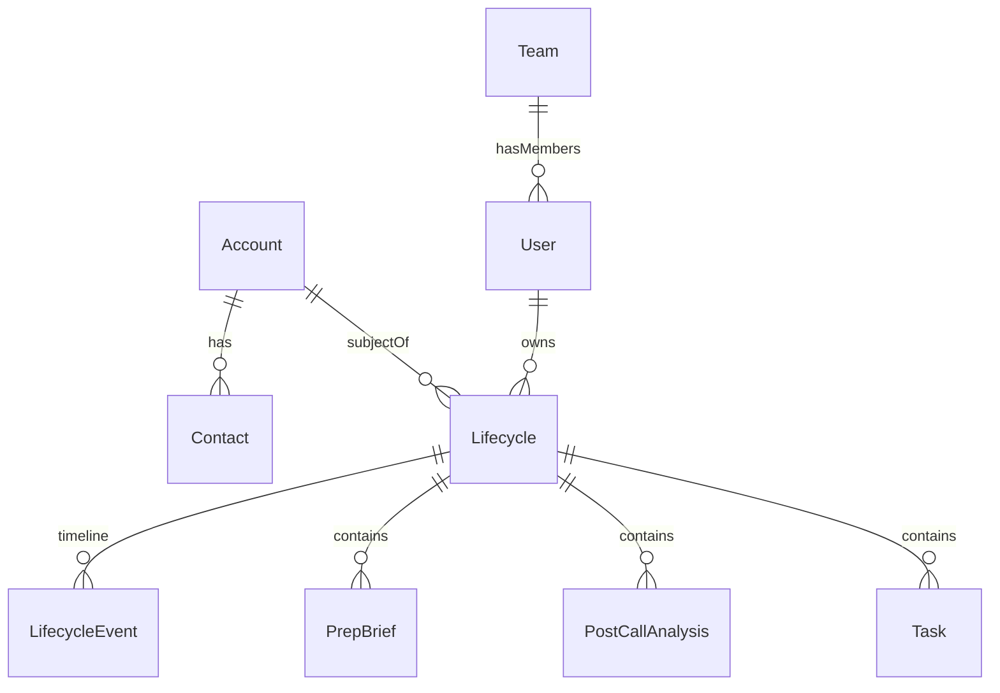

# SE Prep Portal (Lionpath) — App & Domain Context

**SE Singha Paathai** (branded **Lionpath**) is an internal Freshworks **Solution Engineering coaching portal**. It gives SEs one place to go from **research before a call** through **debrief after a call**, with coaching metrics and account history in between.

| | |
|---|---|
| **Live app** | [https://lionpath.benjaminsquare.com](https://lionpath.benjaminsquare.com) |
| **API** | [https://lionpathapi.benjaminsquare.com](https://lionpathapi.benjaminsquare.com) |
| **Repo** | [github.com/skut264/lionpath](https://github.com/skut264/lionpath) |
| **Demo login** | `se@freshworks.com` / `se123` |

---

## Who it's for

| Role | What they do |
|------|--------------|
| **SE** | Run pre-call prep and post-call analysis for their accounts |
| **Manager** | Read team activity (rollup dashboard planned) |
| **Admin** | Manage teams, users, and full data access |

---

## The two core workflows

### 1. Pre-call prep (before discovery/demo)

| | |
|---|---|
| **Input** | Company name, prospect email, optional context |
| **Output** | Printable **one-pager research brief** |
| **Typical wait** | 15–45 seconds (Gemini + web research) |

**What the brief includes:**

- Comparison table (this company vs industry norms)
- Business context, support process, workflows
- SE playbook (use cases, pain points, discovery questions, demo flow)
- Collapsible cited sources (gaps say "unknown" rather than being invented)

### 2. Post-call analysis (after a Zoom recording)

| | |
|---|---|
| **Input** | Zoom cloud recording share link (+ passcode) |
| **Output** | Matching **one-pager debrief** + Quality Coach scorecard |
| **Typical wait** | 10–25 seconds (Zoom transcript fetch + Gemini) |

**What the debrief includes:**

- Call summary and discussion highlights
- Pains, objections, competitive mentions
- Next steps, follow-up email draft, CRM notes
- **Quality Coach** — six-dimension rubric:
  - Discovery
  - Demo alignment
  - Objections
  - Value articulation
  - Next-step clarity
  - Talk balance

---

## Architecture

```
Browser (web/)  ──HTTPS──►  Worker API (worker/)  ──►  Gemini (structured JSON)
       │                           │
  Firebase Auth (optional)     API keys (server-only)
  Domain store                 Zoom transcript fetch
  (Firestore or localStorage)  Legacy history (KV/file)
```

| Layer | Purpose |
|-------|---------|
| **`web/`** | Static HTML/JS/CSS portal — prep, post-call, dashboard, lifecycle views, sidebar history |
| **`worker/`** | TypeScript API — `/api/generate-prep`, `/api/analyze-call`, `/api/history`, auth token verification |
| **Domain store** (`web/domain/*`) | Lifecycle-centric data layer — accounts, lifecycles, artifacts |
| **Legacy storage** | Browser `localStorage` + worker file/KV history (still active during migration) |

### Why a worker instead of browser-side AI?

API keys stay server-side; one pipeline keeps schema, scoring, and prompts consistent for every SE.

### Key API routes

| Route | Purpose |
|-------|---------|
| `POST /api/generate-prep` | Pre-call research brief |
| `POST /api/analyze-call` | Post-call analysis (Zoom link or transcript) |
| `GET/POST /api/history` | Legacy per-email history sync |

### LLM strategy

| Use case | Default model | Latency target |
|----------|---------------|----------------|
| Pre-call (research) | `gemini-3.1-flash-lite` + web search | 15–45s |
| Post-call (transcript) | `gemini-3.1-flash-lite` | 8–20s |

**Pre-call research pipeline** (`worker/src/prep/index.ts` → `gatherResearch`):

| Phase | Typical LLM calls | Parallelism |
|-------|-------------------|-------------|
| Research orchestrator | 1 | Sequential (before playbook; skipped on error) |
| Playbook web search | ~5 (+1 per prospect email) | All queries in parallel |
| Extract facts | 1 | After snippets merged |
| SE context extract | 1 | If additional context present |
| Gap fill | Up to 3 | Parallel; +1 extractFacts when gaps found |
| Synthesize brief | 1 | Separate step (`timings.synthesize`) |

Wall-clock for research + synthesize is usually **15–45s**, dominated by parallel playbook queries and the final synthesize call. Individual LinkedIn queries may fail (`MALFORMED_FUNCTION_CALL`) without aborting the run as long as other queries return snippets.

---

## Authentication

| Mode | When | How |
|------|------|-----|
| **Dummy login** | `web/firebase-config.local.js` has no `projectId` | Email/password in browser (`se@freshworks.com` / `se123`) |
| **Firebase Google SSO** | `projectId` configured | Google sign-in restricted to `@freshworks.com`; worker verifies ID tokens |

Production uses **Firebase Google SSO** with `@freshworks.com` domain restriction. See [FIREBASE_SETUP.md](./FIREBASE_SETUP.md) to enable real login.

**Demo credentials (dummy mode):**

| Role | Email | Password |
|------|-------|----------|
| SE | `se@freshworks.com` | `se123` |
| SE (alt) | `se1@freshworks.com` / `se2@freshworks.com` | `se123` |
| Manager | `manager@freshworks.com` | `mgr123` |

---

## Storage & migration (dual-write)

The app is in a **transition period** from flat per-email history to a lifecycle-centric domain model.

| Storage | What it holds | Status |
|---------|---------------|--------|
| **Legacy** | Prep briefs + post-call history in `localStorage` + worker `/api/history` | Active |
| **Domain store** | Firestore (or localStorage shim in dummy mode) | Active when Firebase on |

Both run in parallel via `web/domain/dual-write.js` — every prep/post-call also links to **Account → Lifecycle → artifacts**.

```
Browser (web/domain/*)  →  Firestore (Firebase SDK)
                       ↘  localStorage shim (dummy mode)

Worker (worker/)        →  Gemini only (stateless)
                       ↘  optional lifecycleId logging
```

---

## Domain model overview

The **Lifecycle** is the **aggregate root** — one SE's engagement thread with one account. Everything else hangs off it.

See also: [DOMAIN_MODEL.md](./DOMAIN_MODEL.md) for indexes, migration runbook, and Firestore schema details.

### Entity relationship



---

## Core entities

### User

- **Firestore:** `users/{uid}`
- **Fields:** `id`, `email`, `displayName`, `role`, `teamId`, `createdAt`, `updatedAt`
- **Roles:** `se` | `manager` | `admin`
- Synced on login from Firebase Auth or dummy auth seed

```typescript
{
  id: string;
  email: string;
  displayName: string;
  role: "se" | "manager" | "admin";
  teamId: string | null;
  createdAt: number;
  updatedAt: number;
}
```

### Team

- **Firestore:** `teams/{teamId}`
- **Fields:** `id`, `name`, `managerId`, `memberIds[]`, timestamps
- Dev seed: `demo-team`

```typescript
{
  id: string;
  name: string;
  managerId: string;
  memberIds: string[];
  createdAt: number;
  updatedAt: number;
}
```

### Account

- **Firestore:** `accounts/{id}`
- **Purpose:** Shared company record across SEs
- **Dedupe key:** normalized `slug` from company name + domain
- One account can have **multiple lifecycles** (different SE owners)

```typescript
{
  id: string;
  name: string;
  domain: string | null;
  slug: string;
  industry?: string;
  metadata?: object;
  createdAt: number;
  updatedAt: number;
}
```

### Contact

- **Firestore:** `contacts/{id}`
- Belongs to one account; unique per `(accountId, email)`
- Upserted from prep form prospect emails and `prep.prospects[]`

```typescript
{
  id: string;
  accountId: string;
  email: string;
  name?: string;
  title?: string;
  role?: string;
  createdAt: number;
  updatedAt: number;
}
```

### Lifecycle (aggregate root)

- **Firestore:** `lifecycles/{id}`
- **Uniqueness rule:** one **active** lifecycle per `(ownerId, accountId)`
- **Denormalized counters:** `prepCount`, `postCallCount`, `openTaskCount`, `latestQualityScore`
- **Events subcollection:** `lifecycles/{id}/events/{eventId}` (audit timeline)

```typescript
{
  id: string;
  ownerId: string;
  teamId: string;
  accountId: string;
  primaryContactId: string | null;
  stage: LifecycleStage;
  status: "active" | "paused" | "archived";
  title: string;
  createdAt: number;
  updatedAt: number;
  lastActivityAt: number;
  prepCount: number;
  postCallCount: number;
  openTaskCount: number;
  latestQualityScore: number | null;
}
```

#### Lifecycle stages

| Stage | Meaning | Auto-trigger |
|-------|---------|--------------|
| `research` | Pre-engagement | On lifecycle create |
| `discovery` | Active discovery | First post-call |
| `demo` | Demo phase | Manual |
| `evaluation` | POC / validation | Manual |
| `business_case` | ROI / procurement | Manual |
| `closed_won` | Won | Manual |
| `closed_lost` | Lost | Manual |
| `nurture` | Long-term nurture | Manual |

**MVP rule:** first post-call auto-advances `research` → `discovery`.

---

## Artifacts (linked to Lifecycle)

| Entity | Collection | Linked by | Notes |
|--------|------------|-----------|-------|
| **PrepBrief** | `prepBriefs` | `lifecycleId` | Wraps existing v8 `Prep` JSON — schema unchanged |
| **PostCallDoc** | `postCalls` | `lifecycleId`, `callIdentityKey` | Dedupe re-analysis via `web/call-identity.js` |
| **TaskDoc** | `tasks` | `lifecycleId` | From post-call next steps, prep, or manual entry |

### PrepBrief

```typescript
{
  id: string;
  lifecycleId: string;
  ownerId: string;
  teamId: string;
  accountId: string;
  input: PrepInput;       // form payload
  prep: Prep;             // generated JSON (worker/src/schema.ts)
  meta: { company, domain?, additionalContext? };
  createdAt: number;
}
```

### PostCallDoc

```typescript
{
  id: string;
  lifecycleId: string;
  ownerId: string;
  teamId: string;
  accountId: string;
  zoomLink?: string;
  title?: string;
  callIdentityKey: string;
  analysis: object;       // worker/src/postcall-schema.ts shape
  transcriptMeta?: unknown;
  qualityScore?: number | null;
  createdAt: number;
  updatedAt: number;
}
```

### TaskDoc

```typescript
{
  id: string;
  lifecycleId: string;
  ownerId: string;
  teamId: string;
  accountId: string;
  title: string;
  status: "recommended" | "pending" | "completed" | "dismissed";
  source: "postcall" | "prep" | "manual";
  sourceKey?: string;
  callId?: string;
  company?: string;
  due?: string;
  dueDate?: number | null;
  createdAt: number;
  completedAt?: number;
}
```

### LifecycleEvent (timeline)

- **Firestore:** `lifecycles/{id}/events/{eventId}`

**Event types:**

| Type | When |
|------|------|
| `lifecycle_created` | New lifecycle |
| `stage_changed` | Manual or auto stage transition |
| `prep_generated` | Prep brief attached |
| `postcall_analyzed` | Post-call attached |
| `task_created` | Task added |
| `task_completed` | Task marked done |
| `contact_updated` | Contact upserted |
| `lifecycle_archived` | Lifecycle archived |
| `artifact_imported` | Migration import |

```typescript
{
  id: string;
  lifecycleId: string;
  type: LifecycleEventType;
  actorId: string;
  timestamp: number;
  payload: object;
}
```

---

## RBAC matrix

| Action | SE | Manager | Admin |
|--------|-----|---------|-------|
| CRUD own lifecycle/artifacts | yes | — | yes |
| Read team lifecycles/artifacts | — | read-only | yes |
| Update lifecycle stage | own | — | yes |
| Manage teams/users | — | — | yes |

**Enforcement:** `firestore.rules` (primary) + `web/domain/rbac.js` (UI guards).

---

## How data flows end-to-end

### Pre-call flow

1. SE selects deal on Account/Deal detail → `setAccountEngagementContext({ dealId, ... })` (see [DEAL_CALL_LINKING.md](./DEAL_CALL_LINKING.md))
2. SE fills form in `web/app.js` → `POST /api/generate-prep` (`buildPayload()` carries `dealId` from session context)
3. Worker (`worker/src/prep.ts`) calls Gemini with web search → structured JSON
4. UI renders one-pager (`web/precall-render.js`)
5. **`linkPrepToLifecycle()`** in `web/domain/dual-write.js`:
   - Upserts **Account** + **Contacts** (`account-service.js`)
   - Gets or creates **Lifecycle** for `(SE, account, deal)` (`lifecycle-service.js`)
   - Saves **PrepBrief** with `dealId` + **LifecycleEvent**
   - Also writes to legacy localStorage briefs

### Post-call flow

1. SE pastes Zoom link in `web/postcall.js` → Pass 0 resolve/match → confirmation gate (deal preselected from prep briefs)
2. SE confirms deal → `POST /api/analyze-call` (and qualify/commit passes)
3. Worker fetches VTT transcript (`worker/src/zoomShare.ts`) → Gemini analysis → Quality Coach score
4. UI renders debrief one-pager; navigates to call record
5. **`linkPostCallToLifecycle()`**:
   - Finds/creates **Account**
   - Gets or creates **Lifecycle** with confirmed `dealId`
   - Upserts **PostCallDoc** by `callIdentityKey` (no duplicates)
   - Auto-advances stage `research` → `discovery` on first post-call
   - Extracts **Tasks** from next steps
   - Also writes to legacy history (`web/history.js` + worker `/api/history`)

Full deal ↔ call linking detail: [DEAL_CALL_LINKING.md](./DEAL_CALL_LINKING.md).

### History / dashboard

- Sidebar and SE dashboard read from legacy history today
- Lifecycle view (`web/lifecycle-view.js`) reads from domain store
- Manager dashboard is a placeholder — team rollup from domain store is on the roadmap

---

## Module map

| Module | Role |
|--------|------|
| `worker/src/domain-model/` | TypeScript types + permissions |
| `web/domain/types.js` | Browser JSDoc types |
| `web/domain/store.js` | Store factory (Firestore vs localStorage) |
| `web/domain/firestore-store.js` | Firestore CRUD |
| `web/domain/local-store.js` | localStorage shim (dummy mode) |
| `web/domain/account-service.js` | Account/Contact upsert |
| `web/domain/lifecycle-service.js` | Lifecycle spine (getOrCreate, attach, stage transitions) |
| `web/domain/dual-write.js` | Bridge prep/post-call → lifecycle |
| `web/lifecycle-view.js` | List + detail/timeline UI |
| `web/auth.js` | Session — dummy login or Firebase SSO |
| `web/crayons-ui.js` | Dew/Crayons UI helpers (status, loading, validation) |
| `worker/src/prep.ts` | Pre-call prompt + Gemini |
| `worker/src/postcall.ts` | Post-call prompt + Gemini |
| `worker/src/quality-score.ts` | Quality Coach overall score |
| `worker/src/schema.ts` | Prep JSON schema |
| `worker/src/postcall-schema.ts` | Post-call JSON schema |

---

## UI views

| View | What an SE sees |
|------|-----------------|
| **Login** | Branded sign-in (dummy credentials or Google SSO) |
| **My dashboard** | Rolling quality averages, radar chart, score trend, recent calls |
| **Pre-call prep** | Company + email form → v3 one-pager |
| **New analysis** | Zoom link form → post-call one-pager + Quality Coach |
| **History (sidebar)** | Past analyses with quality scores |
| **Lifecycle** | Account engagement threads with timeline |
| **Manager view** | Placeholder team dashboard (rollup planned) |

**Design system:** Crayons Dew (`4.3.0-dew.14`) — light theme default, dark mode toggle.

---

## Roadmap

| Item | Status |
|------|--------|
| Pre-call v3 one-pager | Done |
| Post-call redesign + Quality Coach | Done |
| Dew light theme + Crayons UI pass | Done |
| Firebase Google SSO config | Wired — enable with local config |
| Firestore domain model + dual-write | Coded — active when Firebase on |
| Manager team dashboard rollup | Placeholder exists |
| Formal manager-approved rubric | Planned |
| Zoom OAuth | Optional future |
| Cutover from legacy history | Migration script exists; full cutover pending |

---

## Related documentation

| Doc | Audience |
|-----|----------|
| [ARCHITECTURE.md](./ARCHITECTURE.md) | Core vs extension, domain layers |
| [ENTITY_CATALOG.md](./ENTITY_CATALOG.md) | First-class entities vs value objects |
| [ID_STANDARDS.md](./ID_STANDARDS.md) | Prefixed entity ID generation |
| [RELATIONSHIPS.md](./RELATIONSHIPS.md) | FK fields, cardinalities, lookups |
| [RBAC.md](./RBAC.md) | Roles and permissions |
| [adr/001-user-identity.md](./adr/001-user-identity.md) | Internal User.id vs Firebase auth |
| [DOMAIN_MODEL.md](./DOMAIN_MODEL.md) | Entity definitions, indexes, migration runbook |
| [CODE_LOGIC.md](./CODE_LOGIC.md) | File-by-file code map for AI assistants |
| [FIREBASE_SETUP.md](./FIREBASE_SETUP.md) | Enable Google SSO + Firestore |
| [POST_CALL_OVERVIEW.md](./POST_CALL_OVERVIEW.md) | Leadership demo — post-call flow, Quality Coach |
| [VPS_DEPLOY.md](./VPS_DEPLOY.md) | Production deploy |
| [../README.md](../README.md) | Quick start, local dev, deploy |

---

## One-sentence summary

**Lionpath is an SE coaching portal that uses AI to generate pre-call research briefs and post-call debriefs, organized around a lifecycle-centric domain model (Account → Lifecycle → Prep/PostCall/Tasks) with team-scoped RBAC — currently running on legacy per-email history while migrating to Firestore-backed account engagement threads.**
