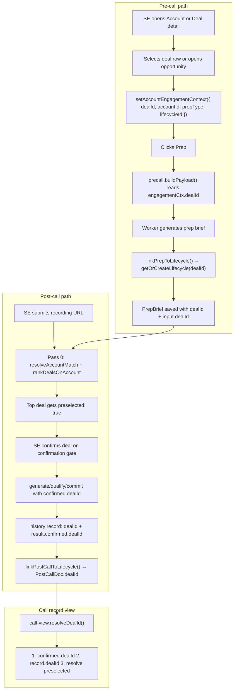

# Deal ↔ Call Linking Logic

How deals connect to calls when SEs run pre-call prep and post-call analysis.

## Important nuance

There is **no deal picker on the pre-call form** and no module literally named "check-in." The flow works like this:

- **Pre-call:** deal is chosen **before** opening prep (on Account or Deal detail). That `dealId` is stashed in session and stamped onto the prep brief.
- **Post-call:** the SE **explicitly confirms** which deal the recording belongs to (confirmation gate). Pass 0 auto-suggests the best deal using pre-call briefs + participant emails.
- **Call record (`#calls/:id`):** reads `dealId` back from the saved post-call analysis.

---

## End-to-end flow



---

## Step 1 — Deal selection before pre-call

When an SE launches prep from an account or deal, the app writes context to **sessionStorage** (`lionpath-account-engagement-context`):

| File | Role |
|------|------|
| `web/domain/account-context.js` | `setAccountEngagementContext` / `getAccountEngagementContext` |
| `web/account-view.js` | On **Prep** click: passes `dealId`, `accountId`, `prepType`, `lifecycleId` |
| `web/deal-view.js` | Same pattern from deal record |

The SE must have navigated from Account/Deal detail with a deal selected. Standalone prep (no account context) has **no deal** — only meeting motion (NB vs expansion).

---

## Step 2 — Pre-call form injects dealId (silently)

`web/precall.js` — `buildPayload()`:

```javascript
const engagementCtx = getAccountEngagementContext();
// ...
dealId: engagementCtx.dealId || undefined,
lifecycleId: engagementCtx.lifecycleId || undefined,
```

The pre-call form collects company, domain, prospect emails — **not** which deal. The deal rides along from session context.

---

## Step 3 — Dual-write stamps deal on Lifecycle + PrepBrief

After prep generates, `web/app.js` calls `linkPrepToLifecycle` in `web/domain/dual-write.js`:

1. Upsert account from prep input
2. `getOrCreateLifecycle(ownerId, accountId, teamId, { dealId: payload.dealId })` in `web/domain/lifecycle-service.js`
   - If `dealId` provided → find active lifecycle for that deal
   - If switching deals on same account → archive old lifecycle
   - If no deal → `resolveDealForEngagement` in `web/domain/deal-service.js` creates/finds NB or expansion deal from motion rules (`web/domain/deal-motion.js`)
3. `attachPrep()` saves `PrepBrief` with:
   - `dealId: lifecycle.dealId`
   - `input: payload` (includes `payload.dealId` for matching later)

**Lifecycle** is the spine: one active engagement thread per account+deal, holding preps and post-calls.

---

## Step 4 — Post-call auto-matches deal using pre-call briefs

When the SE runs post-call analysis, **Pass 0** (`worker/src/postcall/match.ts`) runs before generation.

### Account match (which customer?)

Scores accounts using prep briefs + call participants:

| Signal | Score |
|--------|-------|
| Exact prospect email in brief and on call | 100 |
| Domain match (brief ↔ participant email) | 50 |
| Same SE brief within 30 days | 20 |
| Fuzzy company name in meeting title | 5 |

Briefs come from `buildPostCallResolveContext` in `web/postcall-resolve-context.js` — Firestore `prepBriefs` + local sidebar briefs (`input.dealId`).

### Deal ranking (which opportunity on that account?)

`rankDealsOnAccount()` in `worker/src/postcall/match.ts`:

- Filter deals to matched account
- For each deal, score using briefs where **`brief.dealId === deal.id`**
- If no deal-linked briefs, fall back to all account briefs
- Sort by score; **highest gets `preselected: true`**

This is how a pre-call prep tied to Deal A makes Deal A the default when the same prospect emails appear on the call.

See also: `worker/scripts/test-postcall-resolve.ts` for Pass 0 matching smoke tests.

---

## Step 5 — SE confirms deal (explicit check-in for the call)

`web/postcall.js` — `renderConfirmationGate()` / `readConfirmationSelections()`:

- Radio list of ranked deals (`name="postcall-deal"`)
- Top-ranked deal pre-checked via `preselected`
- SE clicks **Confirm and generate**
- Selected `dealId` sent to generate/qualify/commit APIs
- Saved on call history as `record.dealId` and `result.confirmed.dealId`
- If SE overrides auto-selection → `dealMatchOverride: { from, to, at }`

---

## Step 6 — Post-call dual-write + call record read-back

`linkPostCallToLifecycle` in `web/domain/dual-write.js` resolves `dealId` from:

1. `payload.dealId` (confirmed at gate)
2. `record.dealId`
3. Session engagement context (if same account)

Then attaches `PostCallDoc` with `lifecycle.dealId` and runs downstream writes (MEDDPICC, ARR, traction, etc.) against that deal.

`web/call-view.js` — `resolveDealId(record)` reads back in priority order:

1. `record.result.confirmed.dealId`
2. `record.dealId`
3. `record.result.resolve.deals.find(d => d.preselected).dealId`

---

## Data model summary

| Store | Key linking field |
|-------|-------------------|
| **Deal** | `id`, `accountId`, `type` (new_business / expansion) |
| **Lifecycle** | `dealId`, `accountId`, `ownerId` |
| **PrepBrief** | `lifecycleId`, `dealId`, `input.dealId` |
| **PostCallDoc** | `lifecycleId`, `dealId`, `callIdentityKey` |
| **Call history** | `dealId`, `result.confirmed.dealId`, `result.resolve.deals[]` |

See `docs/ENTITY_CATALOG.md` and `docs/RELATIONSHIPS.md` for full schema detail.

---

## Plain-language summary

1. **Before the meeting:** SE picks a deal on the Account/Deal page, clicks Prep. That deal ID is remembered for the prep session and saved on the prep brief.
2. **After the meeting:** Post-call looks at who was on the call (emails) and compares them to past prep briefs. Briefs that already have a `dealId` boost that deal's score.
3. **SE confirms:** The app pre-selects the best-matching deal; the SE confirms (or changes) it before analysis runs.
4. **Forever after:** The call record, deal view, MEDDPICC, traction, and coaching all read the same `dealId` from the confirmed post-call record.

**Gap to be aware of:** If an SE runs standalone pre-call (no account/deal navigation), there is no deal until post-call matching or dual-write creates one from engagement motion rules.

---

## Related docs

- [APP_AND_DOMAIN_CONTEXT.md](./APP_AND_DOMAIN_CONTEXT.md) — module map and high-level flows
- [adr/003-account-deal-engagement.md](./adr/003-account-deal-engagement.md) — ADR for deal-centric engagement
- [ENTITY_CATALOG.md](./ENTITY_CATALOG.md) — field-level entity reference
