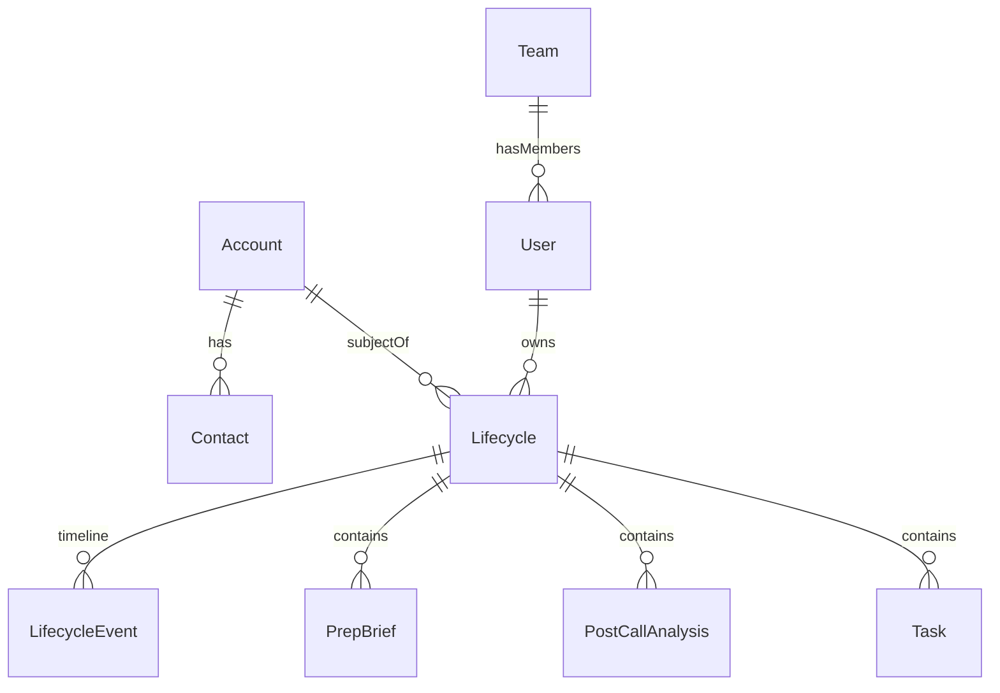

# Domain Model — SE Singha Paathai

Lifecycle-centric domain model for account engagement tracking, team-scoped RBAC, and Firestore persistence.

**Architecture docs:** [ARCHITECTURE.md](./ARCHITECTURE.md) · [ENTITY_CATALOG.md](./ENTITY_CATALOG.md) · [ID_STANDARDS.md](./ID_STANDARDS.md) · [RELATIONSHIPS.md](./RELATIONSHIPS.md) · [RBAC.md](./RBAC.md) · [adr/001-user-identity.md](./adr/001-user-identity.md)

## Entity relationship



## Core entities

### User
- Firestore: `users/{internalUserId}` (document id = internal `usr_*` id, not Firebase uid)
- Auth index: `authIndex/{firebaseUid}` → `{ userId, email }`
- Fields: `id`, `email`, `authUid`, `displayName`, `role` (`se` | `manager` | `admin`), `teamId`, `managerId`, `status` (`active` | `inactive`), timestamps
- `ownerId` on all artifacts = internal `User.id`
- Synced on login from Firebase Auth or dummy auth seed
- See [adr/001-user-identity.md](./adr/001-user-identity.md)

### Team
- Firestore: `teams/{teamId}`
- Fields: `id`, `name`, `managerId`, `memberIds[]`, timestamps
- Dev seed: `demo-team` via `web/domain/seed-dev.js`

### Account
- Firestore: `accounts/{id}`
- Shared across SEs; dedupe key: normalized `slug` from company name + domain
- One account can have multiple lifecycles (different SE owners)

### Contact
- Firestore: `contacts/{id}`
- Belongs to one account; unique `(accountId, email)`
- Upserted from prep form prospect emails + `prep.prospects[]`

### Lifecycle (aggregate root)
- Firestore: `lifecycles/{id}`
- **Uniqueness:** one active lifecycle per `(ownerId, accountId)`
- Denormalized counters: `prepCount`, `postCallCount`, `openTaskCount`, `latestQualityScore`
- Events subcollection: `lifecycles/{id}/events/{eventId}`

### Artifacts
| Collection | Linked by | Notes |
|------------|-----------|-------|
| `prepBriefs` | `lifecycleId` | Wraps existing v8 `Prep` JSON — schema unchanged |
| `postCalls` | `lifecycleId`, `callIdentityKey` | Dedupe re-analysis via `web/call-identity.js` |
| `tasks` | `lifecycleId` | Extends existing task shape |

## Lifecycle stages

| Stage | Meaning | Auto-trigger |
|-------|---------|--------------|
| `research` | Pre-engagement | Lifecycle create |
| `discovery` | Active discovery | First post-call |
| `demo` | Demo phase | Manual |
| `evaluation` | POC / validation | Manual |
| `business_case` | ROI / procurement | Manual |
| `closed_won` / `closed_lost` / `nurture` | Terminal | Manual |

## RBAC matrix

| Action | SE | Manager | Admin |
|--------|-----|---------|-------|
| CRUD own lifecycle/artifacts | yes | — | yes |
| Read team lifecycles/artifacts | — | read-only | yes |
| Update lifecycle stage | own | — | yes |
| Manage teams/users | — | — | yes |

Enforcement: `firestore.rules` (primary) + `web/domain/rbac.js` (UI guards).

## Firestore collections & indexes

See `firestore.indexes.json` for composite indexes. Key queries:

- `lifecycles where ownerId == X orderBy lastActivityAt desc`
- `lifecycles where teamId == X orderBy lastActivityAt desc`
- `lifecycles where ownerId == X and accountId == Y and status == active`
- `postCalls where callIdentityKey == X and ownerId == Y`
- `accounts where slug == X`

### Legacy collections (deprecated)
- `preps`, `postcalls` — read-only during migration; replaced by `prepBriefs`, `postCalls`

## Architecture

```
Browser (web/domain/*)  →  Firestore (Firebase SDK)
                       ↘  localStorage shim (dummy mode)

Worker (worker/)        →  Gemini only (stateless)
                       ↘  optional lifecycleId logging
```

Dual-write period: legacy localStorage/KV **and** domain store run in parallel.

## Module map

| Module | Role |
|--------|------|
| `worker/src/domain-model/` | TypeScript types + permissions |
| `web/domain/types.js` | Browser JSDoc types |
| `web/domain/store.js` | Store factory |
| `web/domain/local-store.js` | localStorage shim (dummy mode) |
| `web/domain/firestore-store.js` | Firestore CRUD |
| `web/domain/account-service.js` | Account/Contact upsert |
| `web/domain/lifecycle-service.js` | Lifecycle spine |
| `web/domain/dual-write.js` | Prep/post-call/task linking |
| `web/lifecycle-view.js` | List + detail UI |

## Migration runbook

### 1. Export legacy data

Browser localStorage keys:
- `se-singha-history:{email}` — post-call history
- `lionpath_briefs` — prep briefs

Worker KV/file:
- `history:{email}` under `HISTORY_FILE_DIR`

### 2. Run migration script

```bash
cd V2/singapaathai
node worker/scripts/migrate-to-lifecycle.mjs \
  --history-dir /path/to/history/files \
  --out migration-output.json
```

Or with a browser export JSON:

```bash
node worker/scripts/migrate-to-lifecycle.mjs --export ./migration-export.json
```

Dry run:

```bash
node worker/scripts/migrate-to-lifecycle.mjs --history-dir ./data/history --dry-run
```

### 3. Import into domain store (dev / dummy mode)

In browser console after signing in:

```javascript
import { importMigrationData } from "./domain/migration-import.js";
const data = await fetch("/migration-output.json").then(r => r.json());
await importMigrationData(data);
```

### 4. Production Firestore

Use Firebase Admin SDK to batch-write `migration-output.json` entities, or rely on dual-write for new activity and migrate historical data incrementally.

### 5. Cutover checklist

- [ ] Manager dashboard reads from domain store
- [ ] Sidebar shows recent lifecycles
- [ ] Migration script run idempotently (re-run safe)
- [ ] Remove dual-write to legacy `preps`/`postcalls` collections
- [ ] Deprecate Worker `/api/history` read path (keep write shim one release)

## Testing

- Lifecycle uniqueness: same SE + same account → one active lifecycle
- Post-call dedupe: same `callIdentityKey` → upsert not duplicate
- Stage auto-advance: first post-call moves `research` → `discovery`
- RBAC: SE cannot read another SE's lifecycle; manager reads team
