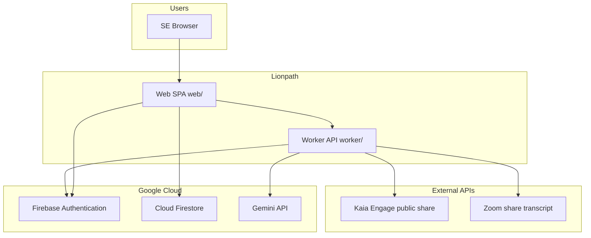

# High-Level Design (HLD) — Lionpath (SE Singha Paathai)

**Product:** Internal Freshworks Solution Engineer portal — pre-call research, post-call debrief, account-centric engagement tracking.  
**Repository:** `singapaathai/`  
**Release line:** `2.0.5` (Kaia share-content hardening on `2.0.4` refactors).  
**Related:** [ARCHITECTURE.md](./ARCHITECTURE.md), [LLD.md](./LLD.md), [CONTACT_ENRICHMENT.md](./CONTACT_ENRICHMENT.md).

---

## 1. Purpose and users

| Actor | Primary goals |
|--------|----------------|
| **Solution Engineer (SE)** | Prep before discovery/demo; debrief after calls; manage accounts, contacts, tasks |
| **Manager** | Team coaching (Quality Coach), scoped visibility into accounts and activity |
| **Director / admin** | Org-wide scope, hierarchy, policy |

### Core workflows

| Workflow | Trigger | Output | Typical latency |
|----------|---------|--------|-----------------|
| **Pre-call prep** | Company + prospect email(s) + optional context | Printable one-pager (discovery + demo tabs), cited research | 15–45 s (LLM) |
| **Post-call analysis** | Zoom recording link or pasted transcript | Summary, next steps, email/CRM drafts, Quality Coach scorecard | 10–25 s |
| **Account / lifecycle** | Prep or post-call completion | Account, contacts, lifecycle, timeline, MEDDPICC signals | Async (Firestore) |

---

## 2. System context



**Principles**

- LLM and third-party API **secrets stay on the worker** (never in the browser bundle).
- **Domain state** (accounts, lifecycles) is owned by the **client + Firestore**, not by the worker.
- Worker is **stateless per request** for generation; optional **KV / file** backends for legacy history and tasks when configured.

---

## 3. Logical architecture

```text
┌──────────────────────────────────────────────────────────────────┐
│  Presentation layer (web/)                                        │
│  Shell: app.js · Views: precall, postcall, dashboard, accounts    │
│  Domain: web/domain/* · Store: Firestore or localStorage shim     │
│  Bridge: dual-write.js (legacy history + domain lifecycle)        │
└────────────────────────────┬─────────────────────────────────────┘
                             │ HTTPS  Authorization: Bearer Firebase ID token
┌────────────────────────────▼─────────────────────────────────────┐
│  API layer (worker/src/index.ts → routes.ts)                      │
│  auth.ts · prep/ · postcall.ts · contact/enrich · kaia/ · tasks   │
└────────────────────────────┬─────────────────────────────────────┘
                             │
         ┌───────────────────┼────────────────────┐
         ▼                   ▼                    ▼
    Gemini providers    Public URL fetchers    Legacy persistence
    research-orchestrator  Kaia, Zoom share    history, tasks, feedback
```

### 3.1 Frontend (`web/`)

| Component | Role |
|-----------|------|
| `index.html` + Crayons | Shell, forms, layout |
| `app.js` | Boot, Firebase, hash routing (`#precall`, `#postcall`, `#accounts/...`), worker URL |
| `precall.js` | Prep form → Kaia hydrate → enrich → research → synthesize |
| `postcall.js` | Transcript/recording → analyze-call |
| `dashboard.js` / `account-view.js` | Coaching metrics, CRM UI |
| `domain/*` | Entity services, RBAC, org scope, store factory |
| `shared.js`, `chart-shared.js` | Shared UI/helpers (2.0.4+) |

### 3.2 Backend (`worker/`)

| Module | Role |
|--------|------|
| `routes.ts` | HTTP route table and handlers |
| `auth.ts` | Verify Firebase ID tokens (JWKS) |
| `prep/` | Research, facts, synthesize, cache, LinkedIn PDF, Kaia in research |
| `research-orchestrator.ts` | Supplemental prospect/company research (2.0.4+) |
| `contact/enrich.ts` | Per-contact profile + inferred DISC |
| `kaia/` | Share URL parse, fetch, cache, prospect excerpts |
| `kaiaShare.ts` | Thin backward-compat facade over `kaia/` |
| `postcall.ts` | Post-call LLM + Quality Coach schema |

### 3.3 HTTP API (summary)

| Method | Path | Purpose |
|--------|------|---------|
| GET | `/api/config` | Model/provider hints for UI |
| POST | `/api/prep/research` | Research phase |
| POST | `/api/prep/synthesize` | Brief from confirmed facts |
| POST | `/api/generate-prep` | Combined prep (legacy single shot) |
| POST | `/api/contact/enrich` | Contact profile + DISC |
| POST | `/api/kaia/share-content` | Kaia bundle (primary, 2.0.5) |
| POST | `/api/fetch-kaia-summary` | Kaia summary (legacy alias) |
| POST | `/api/analyze-call` | Post-call analysis |
| POST | `/api/fetch-transcript` | Zoom share link transcript |
| GET/POST | `/api/history`, `/api/tasks`, `/api/feedback` | Legacy/auxiliary |

Detail: [LLD.md](./LLD.md).

---

## 4. Data architecture (summary)

**Target domain model:** Lifecycle aggregate linking User, Account, Contact, PrepBrief, PostCall, Task, LifecycleEvent.  
**Extension rule:** New capabilities → new entity types referencing core IDs (see [ARCHITECTURE.md](./ARCHITECTURE.md)).

| Storage | Contents | When |
|---------|----------|------|
| **Firestore** | Normalized domain entities | Production (Firebase configured) |
| **localStorage shim** | Same shapes locally | Dummy dev / no Firebase |
| **Legacy history** | Per-email prep/post-call blobs | Sidebar; dual-write + worker file/KV |
| **Worker env** | API keys, CORS, optional KV bindings | Deploy-time |

**Migration:** `dual-write.js` writes domain + legacy history in parallel; not all reads have cut over to Firestore-only.

---

## 5. External integrations

| System | Use | Client-side auth |
|--------|-----|------------------|
| Gemini | Prep, enrich, post-call | Worker API key |
| Firebase Auth | Google SSO | Client SDK |
| Firestore | Domain persistence | Security rules + user session |
| Kaia (Engage) | Meeting summary from public share | None (public link token) |
| Zoom | Transcript from share URL | Passcode in request body |
| Seismic | Customer reference deck URLs | Static industry map in `customer-reference-links.js` |

---

## 6. Deployment view

| Target | Web | API | Notes |
|--------|-----|-----|--------|
| **Local dev** | `dev-server.mjs` :8788 | `npm run dev:node` :8787 | `npm run dev:all` in `web/` |
| **VPS (production)** | nginx static | Node (`tsx`) behind Caddy | `lionpath.benjaminsquare.com` |
| **Cloudflare** | Pages | Worker + wrangler | KV history; local wrangler dev needs `nodejs_compat` for auth deps |
| **Cloud Run (partial)** | Packed static | Packaging in progress | See `deploy/cloudrun/` |

Operational risk: **multiple deploy paths** with hand-synced env (CORS, `WORKER_BASE_URL`, Firebase project). See [FULLSTACK_REVIEW_BRIEF.md](./FULLSTACK_REVIEW_BRIEF.md).

---

## 7. Security (summary)

- Protected API routes: `Authorization: Bearer <Firebase ID token>`.
- Email domain restriction via worker env (`ALLOWED_EMAIL_DOMAIN`).
- Kaia: host allowlist, error sanitization (no share secrets in responses/logs).
- Enrich/prep: structured JSON schemas; browser prefers safe DOM patterns for dynamic text.

---

## 8. Non-functional requirements

| NFR | Approach |
|-----|----------|
| Scale | Internal SE population; single-region deployment typical |
| Availability | Depends on chosen host (VPS/CF) |
| Maintainability | Modular worker routes; domain services on web; extension lanes for new features |
| Testability | `npm test` in `web/` and `worker/` |

---

## 9. Documentation map

| Document | Contents |
|----------|----------|
| [LLD.md](./LLD.md) | Low-level flows and module contracts |
| [ARCHITECTURE.md](./ARCHITECTURE.md) | Core vs extension domain |
| [ENTITY_CATALOG.md](./ENTITY_CATALOG.md) | Entities |
| [CONTACT_ENRICHMENT.md](./CONTACT_ENRICHMENT.md) | Kaia + enrich |
| [DOMAIN_MODEL.md](./DOMAIN_MODEL.md) | Firestore collections |
| [RELEASE_2.0.5.md](./RELEASE_2.0.5.md) | Release notes |
