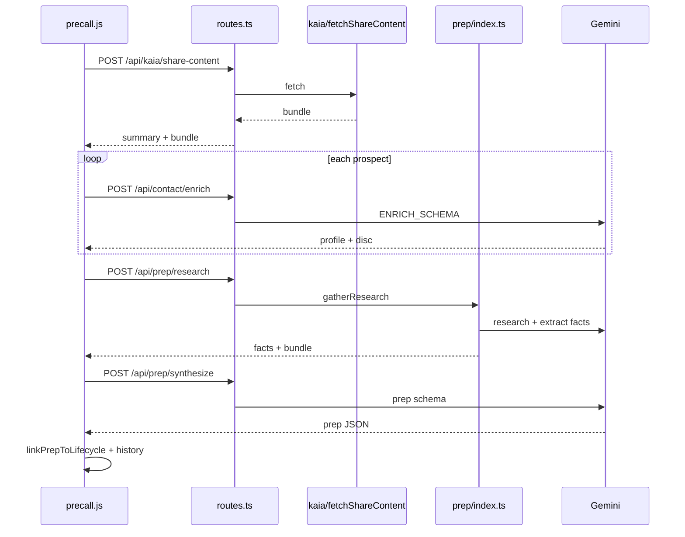

# Low-Level Design (LLD) — Lionpath

**Companion to:** [HLD.md](./HLD.md)  
**Audience:** Engineers implementing or debugging features in `web/` and `worker/`.

---

## Table of contents

1. [Application shell and routing](#1-application-shell-and-routing)
2. [Authentication and session](#2-authentication-and-session)
3. [Pre-call prep (end-to-end)](#3-pre-call-prep-end-to-end)
4. [Contact enrichment and Kaia](#4-contact-enrichment-and-kaia)
5. [Post-call analysis](#5-post-call-analysis)
6. [Accounts, lifecycle, and dual-write](#6-accounts-lifecycle-and-dual-write)
7. [Dashboard and manager coaching](#7-dashboard-and-manager-coaching)
8. [Worker HTTP layer](#8-worker-http-layer)
9. [Research cache and input hash](#9-research-cache-and-input-hash)
10. [Legacy history, tasks, feedback](#10-legacy-history-tasks-feedback)

---

## 1. Application shell and routing

### 1.1 Entry and boot

| File | Responsibility |
|------|----------------|
| `web/index.html` | Crayons components, view containers, prep/postcall forms |
| `web/app.js` | Firebase init, `initDomainStore`, hash routing, `switchView`, worker health banner |
| `web/firebase-config.js` | Project id, auth flags; merged with gitignored `firebase-config.local.js` |

**Boot sequence (simplified)**

1. Load Firebase (if configured) → session in `currentSession`.
2. `initDomainStore(fb)` → Firestore or `local-store.js`.
3. Parse `location.hash` → `switchView(name, opts)` (`dashboard`, `precall`, `postcall`, `accounts`, `profile`, `manager`).
4. `initPrecall`, `initPostcall`, dashboard listeners with `WORKER_BASE_URL` from config.

### 1.2 Hash routes

| Hash pattern | View | Notes |
|--------------|------|--------|
| `#dashboard` / `#overview` | Dashboard | Tab via `currentDashTab` |
| `#precall` | Prep form | |
| `#postcall` | Post-call form | |
| `#accounts` | Account list | |
| `#accounts/{accountId}` | Account detail | |
| `#profile` | Profile settings | |

Implementation: `app.js` — `switchView`, `hashchange` listener, lifecycle/account id resolution from hash segments.

### 1.3 Worker connectivity

- `WORKER_BASE_URL` typically `http://127.0.0.1:8787` (local) or production API host.
- UI polls `/api/config` when worker unreachable; banner from `WORKER_DOWN_MSG` in `app.js`.
- **Local:** use same hostname for web and API (`localhost` vs `127.0.0.1` affects CORS).

---

## 2. Authentication and session

### 2.1 Client

| File | Role |
|------|------|
| `web/firebase-config.js` | `isFirebaseAuthEnabled()`, project id |
| `web/app.js` | Google sign-in, session object on `currentSession` |
| `web/domain/session.js` | `sessionUserId`, role helpers |

**Dummy mode:** no Firebase project → email/password demo user; Firestore shim only.

### 2.2 Worker (`worker/src/auth.ts`)

1. Read `Authorization: Bearer <JWT>`.
2. Fetch Google JWKS (cached 1 h).
3. Verify RS256 signature, `aud` = `FIREBASE_PROJECT_ID`, `exp`, email claim.
4. Optional domain check: `ALLOWED_EMAIL_DOMAIN` (e.g. `freshworks.com`).
5. Handlers call `requireUser(request, env)` before business logic.

**Runtime note:** Firebase verification uses Node-compatible crypto and JWKS fetch. Local **`npm run dev:node`** is the supported path; **wrangler dev** may fail without `nodejs_compat` in `wrangler.toml`.

### 2.3 Identity mapping

- Firebase `uid` ≠ internal `User.id`.
- `authIndex/{firebaseUid}` → internal user record (see [adr/001-user-identity.md](./adr/001-user-identity.md)).
- All domain `ownerId` fields use internal `User.id`.

---

## 3. Pre-call prep (end-to-end)

### 3.1 UI orchestration

**Primary file:** `web/precall.js`

| Step | Action |
|------|--------|
| 1 | Read form: company, domain, emails, LinkedIn PDFs, Kaia URL, Zoom URL, notes |
| 2 | `computePrepInputHash(...)` via `account-service.js` → `prep-input-hash.js` (playbook v2, `kaiaRef`, `contextFp`) |
| 3 | `loadCachedResearch` (optional client-side cache hint) |
| 4 | `hydrateKaiaSummary` → `POST /api/kaia/share-content` → set `kaiaContent`, `kaiaSummary`, clear URL |
| 5 | If `shouldRunProspectEnrich` → parallel `POST /api/contact/enrich` via `prep-contact-enrich.js` |
| 6 | `POST /api/prep/research` with payload + `confirmedProspectProfiles` |
| 7 | User confirms facts (or defaults from research) |
| 8 | `POST /api/prep/synthesize` → render via `precall-render.js` |
| 9 | `onGenerated` → `linkPrepToLifecycle` (`dual-write.js`), sidebar history |

**Deps injected from `app.js`:** `researchUrl`, `synthesizeUrl`, `enrichUrl`, `kaiaShareUrl`, `fetchKaiaUrl` (legacy alias), `getToken`, `authEnabled`.

### 3.2 Worker — research phase

**Entry:** `routes.ts` → `handlePrepResearch` → `runPrepResearch` in `worker/src/prep/index.ts`.

**`gatherResearch` (high level)**

1. Normalize LinkedIn PDF exports; match emails (`linkedin-pdf.ts`).
2. `resolveCachedResearch` if client sent cached bundle + matching hash.
3. `resolveKaiaForPrepInput` (`kaia/prepKaia.ts`) — URL or client `kaiaContent` / `kaiaSummary`.
4. `runPlaybookResearch` + optional Apollo enrichment.
5. `research-orchestrator.ts` — supplemental person/company context (2.0.4+).
6. `extractFacts` → `ResearchFact[]`, sources, snippets.
7. Return `researchBundle`, `researchMeta`, low-confidence hints.

### 3.3 Worker — synthesize phase

**Entry:** `handlePrepSynthesize` → `runPrepSynthesize`.

1. Requires `confirmedFacts` from client.
2. `synthesizePrep` → Gemini with slim `toPrepGeminiResponseSchema` (`gemini-schema.ts`).
3. `validatePrep`, merge enrichments (`merge-enrichment.ts`).
4. Return `prep` JSON (discovery + demo structures), updated meta.

### 3.4 Legacy single-shot

`POST /api/generate-prep` — combines research + synthesize in one handler (`handleGeneratePrep`); UI prefers split research/synthesize for fact confirmation UX.

### 3.5 Customer reference links

**File:** `web/customer-reference-links.js`  
Maps detected industry from prep facts → Seismic deck URL; used in demo tab rendering.

---

## 4. Contact enrichment and Kaia

### 4.1 Kaia — worker modules

| File | Responsibility |
|------|----------------|
| `kaia/shareLink.ts` | Allowlist Engage URLs; decode token; resolve `/s/` redirects |
| `kaia/fetchShareContent.ts` | Public Outreach API; retry; TTL cache (`shareCache.ts`) |
| `kaia/summaryJsonFormat.ts` | Format `summaryJson` with speaker tags |
| `kaia/matchProspectExcerpt.ts` | Match prospect email/name to speaker segments |
| `kaia/prepKaia.ts` | Inject Kaia text into prep research input |
| `kaiaShare.ts` | Legacy exports: `parseKaiaShareUrl`, `fetchKaiaSummaryFromShareLink` → delegates to `kaia/*` |

### 4.2 Kaia — HTTP

| Endpoint | Body | Response |
|----------|------|----------|
| `POST /api/kaia/share-content` | `{ url }` | `{ ok, summary, title, participants, summaryJson, bundle, ... }` |
| `POST /api/fetch-kaia-summary` | `{ kaiaUrl }` | `{ summary, title }` (legacy) |

Handlers: `handleKaiaShareContent`, `handleFetchKaiaSummary` in `routes.ts`.

### 4.3 Contact enrich API

**File:** `worker/src/contact/enrich.ts`

**Request (`ContactEnrichRequest`)**

```text
email, name?, companyName?, companyDomain?
sources: {
  linkedinPdf?: { fileName, text }
  zoomTranscriptExcerpt?: string
  kaiaSummary?: string
  kaiaMeetingUrl?: string   // resolved server-side if summary empty
  additionalNotes?: string
}
```

**Flow**

1. `resolveEnrichSources` — if Kaia URL only → `fetchKaiaSummary` from `kaia/fetchShareContent.ts`.
2. `getProvider(env).generate` with `ENRICH_SCHEMA` (profile + DISC + influence).
3. `inferDiscSource` → `linkedin_pdf` | `zoom` | `kaia` | `merged`.
4. Caps from `contact/enrich-limits.ts` (LinkedIn 16k, Zoom/Kaia 12k, notes 4k).

### 4.4 Client enrich

**Files:** `web/prep-contact-enrich.js`, `web/kaia-prospect-match.js`

- Build per-email Kaia excerpt from `kaiaContent` bundle before enrich call.
- Parallel enrich per prospect email; results → `confirmedProspectProfiles` for research payload.
- UI shows DISC source badges (Kaia / merged) via `precall-render.js` (2.0.4 labels).

Full contract: [CONTACT_ENRICHMENT.md](./CONTACT_ENRICHMENT.md).

---

## 5. Post-call analysis

### 5.1 UI

**File:** `web/postcall.js`

- Input: pasted transcript and/or Zoom recording URL + passcode.
- `POST /api/analyze-call` with optional `lifecycleId` for trace logging.
- Renders one-pager layout (shared with prep); Quality Coach section.

### 5.2 Worker

**File:** `worker/src/postcall.ts`

1. If `recordingUrl` → may use `fetchTranscriptFromShareLink` (`zoomShare.ts`) via separate `/api/fetch-transcript` or internal path.
2. LLM with `POSTCALL_SCHEMA` / postcall provider env (`POSTCALL_MODEL`, `POSTCALL_EFFORT`).
3. Returns structured: summary, next steps, email draft, CRM notes, quality coach dimensions.

### 5.3 Persistence

- Legacy: history entry via sidebar save + worker `/api/history` when configured.
- Domain: `linkPostCallToLifecycle` in `dual-write.js` → `attachPostCall`, contact framework updates.

---

## 6. Accounts, lifecycle, and dual-write

### 6.1 Store abstraction

| File | Role |
|------|------|
| `web/domain/store.js` | `initDomainStore`, `getStore` |
| `web/domain/firestore-store.js` | Firestore CRUD |
| `web/domain/collection-crud.js` | Shared CRUD patterns (2.0.4+) |
| `web/domain/local-store.js` | In-memory + localStorage shim |

### 6.2 Key services

| Service | File | Role |
|---------|------|------|
| Accounts / prep upsert | `account-service.js` | `upsertAccountFromPrep`, research cache keys |
| Lifecycle | `lifecycle-service.js` | `getOrCreateLifecycle`, attach prep/postcall |
| Contacts | `contact-service.js` | MEDDPICC merge, events, enrich merge |
| Org / RBAC | `org-service.js`, `rbac.js` | Scope: own / team / org |

### 6.3 Dual-write bridge

**File:** `web/domain/dual-write.js`

| Function | When |
|----------|------|
| `linkPrepToLifecycle` | After prep generated — account, contacts, lifecycle, prep brief |
| `linkPostCallToLifecycle` | After post-call analyzed |
| Task attach | From prep/postcall action items |

**Legacy parallel path:** history sidebar still reads/writes per-email entries (`history.js`, worker storage) until cutover complete.

### 6.4 Account UI

**File:** `web/account-view.js` (2.0.4 SSO empty-state fixes)

- List + detail accordion, contacts, MEDDPICC, activity feed, deal team.
- Hash: `#accounts/{accountId}`.

---

## 7. Dashboard and manager coaching

### 7.1 SE dashboard

**File:** `web/dashboard.js`

- Overview tab: recent activity, metrics.
- Coaching tab: Quality Coach rollups from history/domain metadata.
- Uses cached `normalizeQualityCoach` (2.0.4 perf).

### 7.2 Manager view

**File:** `web/app.js` + dashboard/manager modules

- Role from session / org (`isManagerRole`, director flags).
- Team-scoped reads via `org-service.js` and Firestore queries.

### 7.3 History sidebar

**File:** `web/history.js`

- Parallel fetch history + tasks on login (2.0.4).
- Dedupe briefs by domain in sidebar (2.0.3+).

---

## 8. Worker HTTP layer

### 8.1 Entry

```text
worker/src/index.ts
  → CORS preflight
  → routes[path][method]
  → task PATCH/DELETE subroutes
```

### 8.2 Route map

Defined in `worker/src/routes.ts` — `export const routes` (see [HLD.md](./HLD.md) API table).

### 8.3 Environment (`Env`)

Key vars: `GEMINI_API_KEY`, `LLM_PROVIDER`, `MODEL`, `EFFORT`, postcall variants, `ALLOWED_ORIGINS`, `FIREBASE_PROJECT_ID`, `ALLOWED_EMAIL_DOMAIN`, optional `HISTORY_KV`, history file dir bindings.

Local secrets: `worker/.dev.vars` (gitignored).

### 8.4 Providers

**Directory:** `worker/src/providers/` — Gemini default; abstraction for model + schema + thinking level.

---

## 9. Research cache and input hash

### 9.1 Hash contract (must stay in sync)

| Runtime | File |
|---------|------|
| Worker | `worker/src/prep/input-hash.ts` |
| Browser | `web/prep-input-hash.js` |

**Payload includes:** normalized company, domain, sorted emails, LinkedIn fingerprint, `playbookVersion: "2"`, `kaiaRef`, `contextFp` (additional notes).

**Tests:** `worker/scripts/test-prep-input-hash.ts`, `web/scripts/test-prep-input-hash.mjs`.

### 9.2 Client cache

**File:** `web/domain/account-service.js`

- `loadCachedResearch(company, domain, inputHash)` — TTL ~30 days (`RESEARCH_TTL_MS`).
- Invalidates when hash mismatch (Kaia URL, notes, PDF set, playbook version).

### 9.3 Worker cache

**File:** `worker/src/prep/cache.ts` — `resolveCachedResearch`, `buildResearchBundle` when client sends cached bundle + hash alignment.

---

## 10. Legacy history, tasks, feedback

### 10.1 History

| Layer | Implementation |
|-------|----------------|
| Browser | `localStorage` per email |
| Worker VPS | JSON files on disk |
| Worker CF | `HISTORY_KV` binding |

API: `GET/POST /api/history` — `worker/src/history.ts`.

### 10.2 Tasks

API: `GET/POST /api/tasks`, `PATCH/DELETE /api/tasks/:id` — `worker/src/tasks.ts`.

### 10.3 Feedback

API: `GET/POST /api/feedback` — product feedback capture — `worker/src/feedback.ts`.

These are **orthogonal** to Firestore lifecycle; dashboard may merge views until legacy retirement.

---

## Appendix A — Key file index

| Area | Paths |
|------|--------|
| Prep UI | `web/precall.js`, `web/precall-render.js` |
| Post-call UI | `web/postcall.js` |
| Enrich | `web/prep-contact-enrich.js`, `worker/src/contact/enrich.ts` |
| Kaia | `worker/src/kaia/*`, `worker/src/routes.ts` |
| Prep worker | `worker/src/prep/*`, `worker/src/research-orchestrator.ts` |
| Domain | `web/domain/*`, `web/dual-write.js` |
| Auth | `worker/src/auth.ts`, `web/firebase-config.js` |
| Deploy | `deploy/vps/`, `deploy/cloudrun/`, `worker/wrangler.toml` |

---

## Appendix B — Sequence diagram (prep + enrich)



---

*Last updated for release line **2.0.5**.*
