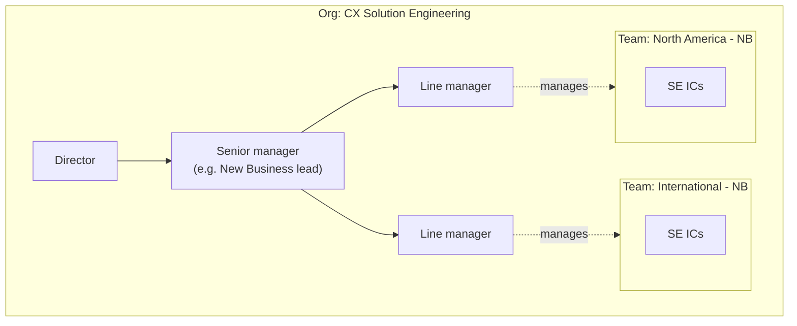
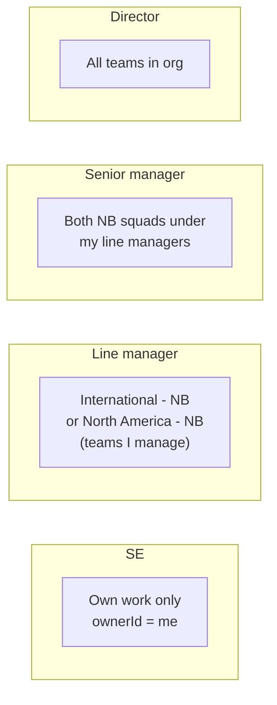

# Org hierarchy — teams, people, and visibility (visual)

User-facing **team names** are region + motion (e.g. **International - NB**). Internal Firestore ids stay stable (`team_ajay`, `team_nikil`) — see `web/domain/constants.js` (`TEAM_DISPLAY_NAMES`).

## People tree + leaf teams



## Visibility scope (target model)

Artifacts and lifecycles carry **`teamId`** (squad) and **`ownerId`** (SE).



## Scope bubbles (ASCII)

```
                 ┌─────────────────────────────────────┐
                 │ DIRECTOR — all squads in org        │
                 │  ┌───────────────────────────────┐  │
                 │  │ SENIOR — subtree (NB example) │  │
                 │  │  ┌──────────────┐ ┌─────────┐ │  │
                 │  │  │ Intl - NB    │ │ NA - NB │ │  │
                 │  │  │  SE SE SE    │ │ SE SE   │ │  │
                 │  │  └──────────────┘ └─────────┘ │  │
                 │  └───────────────────────────────┘  │
                 └─────────────────────────────────────┘
```

## Freshdesk-style mapping

| Freshdesk | Lionpath |
|-----------|----------|
| Roles | `User.role` — se / manager / admin |
| Add to groups | `User.teamId`, `Team.managerId`, roster `memberIds` |
| Scope (tickets) | Read filter on `teamId` / `ownerId` (today: own, one team, or whole org; subtree for seniors is planned) |

## Related

- [RBAC.md](./RBAC.md)
- [adr/002-org-hierarchy.md](./adr/002-org-hierarchy.md)
