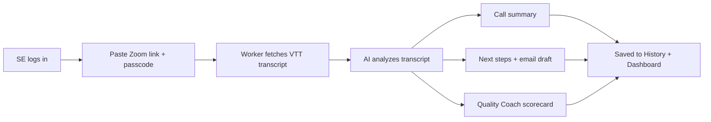

# Post-Call Analysis — Overview

**SE Singha Paathai** · Freshworks Solution Engineering · MVP demo document

---

## What is Post-Call Analysis?

Post-Call Analysis turns a recorded customer demo into actionable output in under a minute. An SE pastes a Zoom recording link (and passcode if needed); the system pulls the audio transcript, reads what was actually said on the call, and returns three things: a structured **call summary**, a prioritized **next-steps plan** (including a follow-up email draft and CRM notes), and a **Quality Coach scorecard** that scores how the SE ran the call across six coaching dimensions. It is designed to replace the manual “write up the call and self-review the demo” step — not to replace the SE, but to give every SE a consistent, evidence-based debrief after every customer conversation.

---

## Who It's For

| Audience | How they use it |
|----------|-----------------|
| **Solution Engineers** | Run analysis after demos and discovery calls; review next steps; use Quality Coach feedback to improve the next call. |
| **SE Managers** | Review individual scorecards during 1:1s; spot patterns across an SE's dashboard (strongest dimension, focus area, score trend). Team rollup view is planned. |
| **Demo / leadership audience** | See the end-to-end flow: paste link → transcript → AI analysis → printable results in ~10–25 seconds. |

---

## How It Works

The SE does not upload files manually in the default flow. They paste the **Zoom cloud recording share link** from the “recording is ready” email or from Zoom → Cloud Recordings → Share.

**Step by step:**

1. **Sign in** to the SE portal (demo credentials below).
2. **Open “New analysis”** and paste the Zoom recording URL. If the passcode is not embedded in the link, paste it in the passcode field — or paste both in one line: `https://…/rec/share/… Passcode: abc123`.
3. **Click “Analyze call.”** The backend fetches the transcript from Zoom’s public share APIs (no Zoom OAuth required for MVP).
4. **Wait ~10–25 seconds.** The UI shows a status message and prevents double-submit.
5. **Review results** — call summary, next steps, and Quality Coach. Copy the follow-up email, print/PDF, or copy raw JSON.
6. **History & dashboard update automatically** — the analysis is stored under the logged-in SE’s account and feeds cumulative metrics.

**Fallback:** Developers and power users can also send a raw VTT transcript directly to the API (`/api/analyze-call`), but the product UI is optimized for the Zoom link flow.

---

## What You Get

### 1. Call Summary

A factual recap of what happened on the call — not a generic CRM blurb.

| Section | What it contains |
|---------|------------------|
| **Headline** | One-line title for the call |
| **Customer context** | Who they are and why they met |
| **Attendees** | Names, roles, and engagement level |
| **Key topics** | Main themes discussed |
| **Pain points confirmed** | Problems the customer acknowledged |
| **Objections raised** | Concerns or pushback |
| **Competitive mentions** | Other vendors or tools referenced |
| **Decisions made** | Agreements or conclusions reached |
| **Open questions** | Items still unresolved |

### 2. Next Steps

Action-oriented output the SE can use immediately.

| Section | What it contains |
|---------|------------------|
| **SE actions** | Prioritized tasks (High / Medium / Low) with due hints and rationale |
| **AE actions** | What the account executive should own |
| **Customer commitments** | What the prospect agreed to do |
| **Suggested follow-up email** | Subject + body ready to copy |
| **CRM notes** | Paste-ready summary for Salesforce / CRM |

Toolbar actions: **Print / PDF**, **Copy follow-up email**, **Copy JSON**.

### 3. Quality Coach Scorecard

Coaching feedback modeled on how an SE manager would QA a recorded demo — calibrated to be honest, not flattering.

- **Overall score** — 0–10 gauge with a label (Excellent, Strong, Good, Developing, Needs focus)
- **Radar chart** — visual profile across all six dimensions
- **Expandable scorecard** — each dimension shows score, written feedback, and **transcript evidence** (quote or paraphrase)
- **Strengths** — genuine positives only
- **Improvements** — actionable gaps
- **Missed opportunities** — moments where the SE could have gone deeper

---

## Quality Coach Dimensions

Each dimension is scored **1–5**. The AI must cite transcript evidence; it does not invent moments that did not happen.

| Dimension | What it means for an SE |
|-----------|-------------------------|
| **Discovery** | Did you ask open questions, uncover real pain, and quantify impact — or jump straight into the demo? Strong discovery means the customer talked about *their* problems before you showed features. |
| **Demo alignment** | Did you show capabilities tied to what the customer said they need — or run a generic product tour? The demo should feel custom, not canned. |
| **Objections** | When concerns came up (price, migration, competitors, timing), did you acknowledge, clarify, and respond with specifics — or gloss over them? |
| **Value articulation** | Did you connect Freshworks capabilities to business outcomes the customer cares about — or list features without tying them to value? |
| **Next-step clarity** | Did the call end with clear owners, dates, and mutual commitments — or vague “we’ll follow up”? |
| **Talk balance** | Was speaking time reasonably balanced? If the SE dominates (>~60% talk time), discovery and engagement usually suffer. |

---

## Scoring Explained

### Per dimension (1–5)

| Score | Label | Typical meaning |
|-------|-------|-----------------|
| **5** | Exceptional | Best-in-class execution with clear transcript proof — reserved for top ~5% of calls |
| **4** | Solid | Meets SE expectations; only minor gaps |
| **3** | Acceptable | Basic execution with noticeable weaknesses — **typical for an average call** |
| **2** | Needs improvement | Significant misses or weak handling |
| **1** | Missed | Dimension largely absent or handled poorly |

### Overall score (out of 10)

The overall score is **computed automatically** from the six dimension scores (average performance scaled to 0–10). The AI does not assign the overall number directly — this keeps scoring consistent.

| Overall | Label |
|---------|-------|
| **9.0+** | Excellent |
| **7.0 – 8.9** | Strong |
| **5.5 – 6.9** | Good |
| **4.0 – 5.4** | Developing |
| **Below 4.0** | Needs focus |

> **MVP calibration note:** Scoring is intentionally strict. A typical average SE call should land around **3–3.5 per dimension** (~6–7 overall), not 4–5 across the board. A score of 5 on any dimension requires specific transcript evidence of excellence. This calibration will be refined with manager input and a formal rubric in a later phase.

---

## SE Dashboard & History

### My Dashboard

After one or more analyzed calls, the **My dashboard** view shows cumulative quality metrics:

| Metric / chart | Purpose |
|----------------|---------|
| **Calls analyzed** | Total post-call runs with Quality Coach data |
| **Average overall score** | Rolling average out of 10 |
| **Strongest dimension** | Highest average across calls |
| **Focus area** | Lowest average — where to coach |
| **Dimension profile (radar)** | Shape of strengths vs gaps |
| **Dimension averages (bars)** | Side-by-side comparison |
| **Score trend** | Last several calls, oldest → newest |
| **Score distribution** | How many calls landed Excellent / Strong / Good / etc. |
| **Recent calls table** | Click any row to reopen full analysis |

### History (sidebar)

Every analyzed call is saved under the SE’s login. The sidebar lists recent recordings (newest first, up to 100). Click any item to reload the full summary, next steps, and Quality Coach output.

**Current storage (MVP):** Browser **localStorage** keyed by SE email. Clearing browser data removes history. **Firebase Auth + Firestore** will replace this for production persistence and cross-device access.

---

## What SEs Do vs What IT / Admin Runs

| Responsibility | SE | IT / Admin / Dev |
|----------------|----|--------------------|
| Log in to the portal | ✓ | — |
| Paste Zoom link + passcode | ✓ | — |
| Review summary, next steps, coaching | ✓ | — |
| Enable Zoom cloud recording + audio transcript | — | ✓ (Zoom admin) |
| Optional: embed passcode in shareable link | — | ✓ (Zoom admin setting) |
| Deploy web app (Cloudflare Pages) | — | ✓ |
| Deploy API worker (Cloudflare Worker) | — | ✓ |
| Store **Gemini API key** (server-side secret) | — | ✓ |
| Configure CORS, Firebase (when enabled) | — | ✓ |
| Run `npm run dev` locally for testing | — | ✓ (developers only) |

**Important:** SEs never handle API keys. All LLM calls go through the Worker; keys live in `wrangler secret` / `.dev.vars` on the server only.

---

## Zoom Requirements

For the recording-link flow to work, these Zoom settings should be in place:

| Setting | Why it matters |
|---------|----------------|
| **Cloud recording enabled** | Recording must exist |
| **Audio transcript enabled** | Generates the VTT file the system reads |
| **Allow anyone with link to download** (or equivalent share access) | Worker must fetch the transcript file |
| **Embed passcode in shareable link** *(recommended)* | Best UX — SE pastes one line, no separate passcode field |

**What does not work in MVP (without Zoom OAuth):**

- Links that require full Zoom login (not just passcode)
- Expired or deleted recordings
- On-demand registration pages
- Recordings with no audio transcript generated

---

## Current Limitations & What's Coming Later

### MVP scope (today)

- Zoom **share/play link + passcode** — no Zoom OAuth app required
- Single-call analysis with strict AI coaching rubric
- Personal SE dashboard and sidebar history
- Dummy login for demos; **localStorage** for history
- Manager login shows a **placeholder team view** (not yet built)
- Transcript trimmed to ~last 6,000 words (~30–40 min of speech) for speed

### Planned / later phases

| Item | Status |
|------|--------|
| **Firebase Google SSO** | Config ready; enable when project ID is set |
| **Firestore history** (cross-device, durable) | Rules exist; wired when Firebase is on |
| **Production deploy** | Worker + Pages; see README deploy section |
| **Formal manager-approved rubric** | Replace MVP AI calibration with signed-off criteria |
| **Manager team dashboard** | Rollup across SEs, not just individual view |
| **Zoom OAuth** | Optional — for accounts where share links are restricted |
| **Manual VTT upload in UI** | API supports it; UI is link-first today |

---

## Demo Login Credentials

For local demo or shared tunnel environments (dummy auth — not production SSO):

| Role | Email | Password |
|------|-------|----------|
| **SE** | `se@freshworks.com` | `se123` |
| **SE (alt)** | `se1@freshworks.com` / `se2@freshworks.com` | `se123` |
| **Manager** | `manager@freshworks.com` | `mgr123` |

**Suggested demo path:** Log in as SE → **New analysis** → paste a real or sample Zoom recording link → show results → open **My dashboard** → click a **History** item to reload a past call.

---

## FAQ for Leadership

### Why a Cloudflare Worker instead of calling the AI from the browser?

Three reasons: **security**, **platform limits**, and **consistency**.

- API keys must never live in the browser where any user could extract them.
- Firebase’s free tier blocks outbound LLM calls from Cloud Functions; the Worker’s free tier allows `fetch` to Gemini/Claude.
- One server-side pipeline ensures every SE gets the same schema, scoring logic, and prompt calibration.

### Why Gemini for post-call?

Post-call is **structured JSON extraction** from a transcript — no web research needed. **Gemini 3.1 Flash Lite** is fast (~8–20 seconds), cost-efficient at SE volume, and supports enforced JSON schema output. Pre-call prep can use a heavier model with web search; post-call optimizes for speed and repeatability. Anthropic Claude remains available as a fallback provider in the same Worker.

### How long does analysis take?

| Stage | Typical time |
|-------|----------------|
| Fetch transcript from Zoom | 2–5 seconds |
| AI analysis (Gemini Flash Lite) | 8–20 seconds |
| **Total (user-facing)** | **~10–25 seconds** |

The UI message says “usually 10–25 seconds” and disables the form while processing.

### Where is call data stored? What about privacy?

| Data | Location (MVP) |
|------|----------------|
| Zoom link / passcode | Sent to Worker for transcript fetch; not persisted server-side in MVP |
| Transcript | Processed in memory on the Worker; sent to the LLM provider for analysis |
| Analysis results | Stored in browser **localStorage** under the SE’s email key |
| API keys | Cloudflare Worker secrets only |

**Implications for demo:** History is per-browser, per-machine. Clearing site data deletes history. Production will move history to **Firestore** with Firebase Auth and `@freshworks.com` domain restriction. Transcripts are not retained on the Worker after the request completes in the current implementation — only the structured analysis is kept client-side.

### Is the Quality Coach score “official”?

Not yet. It is an **MVP AI-assisted QA** calibrated to be strict and evidence-based, designed to spark coaching conversations — not to replace manager judgment or formal performance reviews. A manager-approved rubric and optional human override are on the roadmap.

### What does an SE need on their laptop?

**Nothing**, once deployed. SEs open the Cloudflare Pages URL in a browser. Local `npm run dev` is for developers and demo hosts only.

---

## Related Documentation

- [README.md](../README.md) — setup, deploy, and technical architecture
- [TEAM_SETUP.md](../TEAM_SETUP.md) — team onboarding and tunnel sharing
