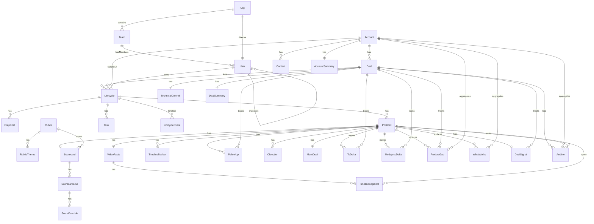

# Relationships — Foreign Keys, Cardinalities, and Lookups

Reference for how domain entities connect. See [ENTITY_CATALOG.md](./ENTITY_CATALOG.md) for entity definitions and [ID_STANDARDS.md](./ID_STANDARDS.md) for ID format.

---

## Entity relationship diagram



### Registered collections (spec ↔ Firestore)

| Spec name | Firestore collection | Parent / natural key |
|-----------|---------------------|----------------------|
| `scorecards` | `scorecards` | `(callId)` — 1:1 with PostCall |
| `scorecard_lines` | `scorecardLines` | `(scorecardId, themeKey)` |
| `score_overrides` | `scoreOverrides` | append-only per line |
| `rubrics` | `rubrics` | `(callType, version)` |
| `rubric_themes` | `rubricThemes` | `(rubricId, themeKey)` |
| `meddpicc_deltas` | `meddpiccDeltas` | `(callId, slot)` |
| `technical_commit` | `technicalCommits` | `(dealId)` — 1:1 with Deal |
| `tc_deltas` | `tcDeltas` | `(callId, field)` |
| `deal_signals` | `dealSignals` | `(callId)` — Pass 8 rollup |
| `product_gaps` | `productGaps` | `(postCallId, verbatim hash)` — Pass 6 draft rows |
| `what_works` | `whatWorks` | `(postCallId, verbatim hash)` — Pass 6 positive rows |
| `gap_clusters` | `gapClusters` | async embedding clusters — gaps reference via `clusterId` |
| `clustering_state` | `clusteringState` | `(orgId)` — pipeline cursor |
| `deal_summaries` | `dealSummaries` | `(dealId)` — one current row |
| `account_summaries` | `accountSummaries` | `(accountId)` — one current row |
| `price_book` | `priceBooks` | `(product, tier, currency, term, effectiveFrom)` |
| `addon_price_book` | `addonPriceBooks` | `(addon, appliesTo, requiresTier, currency, term, effectiveFrom)` |
| `assumptions_book` | `assumptionsBooks` | `(key, scope, scopeValue, version, effectiveFrom)` |
| `arr_lines` | `arrLines` | `(callId, kind, addonKey)` — per-call breakdown row |
| `arr_overrides` | `arrOverrides` | append-only per deal field edit |

---

## Cardinality decisions

| Relationship | Cardinality | Implementation |
|--------------|-------------|----------------|
| Team → User | 1:N | `User.teamId` → `Team.id` |
| Org → Team | 1:N | `Team.orgId` → `Org.id` |
| Org → User (director) | 1:1 | `Org.directorId` → `User.id` |
| User → User (manager) | N:1 | `User.managerId` → `User.id` |
| User → Lifecycle | 1:N | `Lifecycle.ownerId` → `User.id` |
| Account → Contact | 1:N | `Contact.accountId` → `Account.id` |
| Account → Deal | 1:N | `Deal.accountId` → `Account.id` |
| Deal → Lifecycle | 1:N | `Lifecycle.dealId` → `Deal.id` (SE lens) |
| Account → Lifecycle | 1:N | `Lifecycle.accountId` → `Account.id` |
| User ↔ Account | M:N (logical) | **Lifecycle** as smart junction — no separate join table |
| Lifecycle → Artifacts | 1:N | `artifact.lifecycleId` → `Lifecycle.id` |
| Lifecycle → Events | 1:N | subcollection `lifecycles/{id}/events/{eventId}` |
| Rubric → RubricTheme | 1:N | `RubricTheme.rubricId` → `Rubric.id`; doc id `{rubricId}__{themeKey}` |
| PostCall → Scorecard | 1:1 | `Scorecard.callId` → `PostCall.id` |
| Scorecard → ScorecardLine | 1:N | `ScorecardLine.scorecardId` → `Scorecard.id` |
| ScorecardLine → ScoreOverride | 1:N | `ScoreOverride.scorecardLineId` → `ScorecardLine.id` |
| Rubric → Scorecard | 1:N | `Scorecard.rubricId` → `Rubric.id` |
| PostCall → VideoFacts | 1:1 | `VideoFacts.callId` → `PostCall.id` |
| VideoFacts → TimelineSegment | 1:N | `TimelineSegment.videoFactsId` → `VideoFacts.id` (null when transcript-derived) |
| PostCall → TimelineMarker | 1:N | `TimelineMarker.callId` → `PostCall.id` |
| PostCall → FollowUp | 1:N | `FollowUp.callId` → `PostCall.id` |
| Deal → FollowUp | 1:N | `FollowUp.dealId` → `Deal.id` |
| PostCall → Objection | 1:N | `Objection.callId` → `PostCall.id` |
| PostCall → MomDraft | 1:1 | `MomDraft.callId` → `PostCall.id` |
| Deal → TechnicalCommit | 1:1 | `TechnicalCommit.dealId` → `Deal.id` |
| PostCall → TcDelta | 1:N | `TcDelta.callId` → `PostCall.id` |
| Deal → TcDelta | 1:N | `TcDelta.dealId` → `Deal.id` |
| PostCall → MeddpiccDelta | 1:N | `MeddpiccDelta.callId` → `PostCall.id` |
| Deal → MeddpiccDelta | 1:N | `MeddpiccDelta.dealId` → `Deal.id` |
| PostCall → ProductGap | 1:N | `ProductGap.postCallId` → `PostCall.id` |
| Deal → ProductGap | 1:N | `ProductGap.dealId` → `Deal.id` |
| Account → ProductGap | 1:N | `ProductGap.accountId` → `Account.id` |
| PostCall → WhatWorks | 1:N | `WhatWorks.postCallId` → `PostCall.id` |
| Account → WhatWorks | 1:N | `WhatWorks.accountId` → `Account.id` |
| PostCall → DealSignal | 1:1 | `DealSignal.callId` → `PostCall.id` |
| Deal → DealSignal | 1:N | `DealSignal.dealId` → `Deal.id` |
| Deal → DealSummary | 1:1 | `DealSummary.dealId` → `Deal.id` — current row rewritten after each call |
| Account → AccountSummary | 1:1 | `AccountSummary.accountId` → `Account.id` — current row rewritten after each call |
| Deal → ArrLine | 1:N | `ArrLine.dealId` → `Deal.id` — rows keyed by `callId` for snapshot traceability |
| PostCall → ArrLine | 1:N | `ArrLine.callId` → `PostCall.id` — one row set per ARR compute on the call |
| Account → ArrLine | 1:N | `ArrLine.accountId` → `Account.id` — cross-deal attach matrix (task 2.8) |

---

## Foreign key map

### User

| FK field | Target | Required |
|----------|--------|----------|
| `teamId` | `Team.id` | No (null for org director) |
| `orgId` | `Org.id` | No |
| `managerId` | `User.id` | No |

### Team

| FK field | Target | Required |
|----------|--------|----------|
| `orgId` | `Org.id` | No |
| `managerId` | `User.id` | Yes |
| `memberIds[]` | `User.id` | No (denormalized roster) |

### Org

| FK field | Target | Required |
|----------|--------|----------|
| `directorId` | `User.id` | Yes |
| `teamIds[]` | `Team.id` | No (denormalized roster) |

### Contact

| FK field | Target | Required |
|----------|--------|----------|
| `accountId` | `Account.id` | Yes |

### Deal

| FK field | Target | Required |
|----------|--------|----------|
| `accountId` | `Account.id` | Yes |
| `ownerId` | `User.id` | Yes |
| `teamId` | `Team.id` | Yes |
| `orgId` | `Org.id` | No |
| `primaryContactId` | `Contact.id` | No |

### Lifecycle

| FK field | Target | Required |
|----------|--------|----------|
| `dealId` | `Deal.id` | No (required for new records post ADR-003) |
| `ownerId` | `User.id` | Yes |
| `teamId` | `Team.id` | Yes |
| `orgId` | `Org.id` | Yes |
| `accountId` | `Account.id` | Yes |
| `primaryContactId` | `Contact.id` | No |

### Artifacts (PrepBrief, PostCall, Task)

| FK field | Target | Required |
|----------|--------|----------|
| `lifecycleId` | `Lifecycle.id` | Yes |
| `dealId` | `Deal.id` | No (required for new records post ADR-003) |
| `ownerId` | `User.id` | Yes (denormalized) |
| `teamId` | `Team.id` | Yes (denormalized) |
| `orgId` | `Org.id` | Yes (denormalized) |
| `accountId` | `Account.id` | Yes (denormalized) |

### ContactEvent

| FK field | Target | Required |
|----------|--------|----------|
| `contactId` | `Contact.id` | Yes (implicit via path) |
| `actorId` | `User.id` | Yes |

### Rubric

Reference data — no owner/team FKs. `Scorecard.rubricId` → `Rubric.id`.

### Scorecard

| FK field | Target | Required |
|----------|--------|----------|
| `callId` | `PostCall.id` | Yes |
| `rubricId` | `Rubric.id` | Yes |
| `ownerId` | `User.id` | Yes |
| `teamId` | `Team.id` | Yes |
| `orgId` | `Org.id` | Yes |
| `accountId` | `Account.id` | Yes |

### ScorecardLine

| FK field | Target | Required |
|----------|--------|----------|
| `scorecardId` | `Scorecard.id` | Yes |
| `callId` | `PostCall.id` | Yes (denormalized) |
| `ownerId` | `User.id` | Yes (denormalized) |
| `teamId` | `Team.id` | Yes (denormalized) |
| `orgId` | `Org.id` | Yes (denormalized) |

### ScoreOverride

| FK field | Target | Required |
|----------|--------|----------|
| `scorecardLineId` | `ScorecardLine.id` | Yes |
| `scorecardId` | `Scorecard.id` | Yes (denormalized) |
| `callId` | `PostCall.id` | Yes (denormalized) |
| `userId` | `User.id` | Yes |

### VideoFacts

| FK field | Target | Required |
|----------|--------|----------|
| `callId` | `PostCall.id` | Yes |
| `ownerId` | `User.id` | Yes |
| `teamId` | `Team.id` | Yes |
| `orgId` | `Org.id` | Yes |
| `accountId` | `Account.id` | Yes |

### TimelineSegment

| FK field | Target | Required |
|----------|--------|----------|
| `callId` | `PostCall.id` | Yes |
| `videoFactsId` | `VideoFacts.id` | Only when `source == "video"` — null for transcript spine |
| `ownerId` | `User.id` | Yes (denormalized) |
| `teamId` | `Team.id` | Yes (denormalized) |
| `orgId` | `Org.id` | Yes (denormalized) |

### TimelineMarker

| FK field | Target | Required |
|----------|--------|----------|
| `callId` | `PostCall.id` | Yes |
| `ownerId` | `User.id` | Yes (denormalized) |
| `teamId` | `Team.id` | Yes (denormalized) |
| `orgId` | `Org.id` | Yes (denormalized) |

### RubricTheme

| FK field | Target | Required |
|----------|--------|----------|
| `rubricId` | `Rubric.id` | Yes |

### FollowUp

| FK field | Target | Required |
|----------|--------|----------|
| `callId` | `PostCall.id` | Yes |
| `dealId` | `Deal.id` | No |
| `ownerId` | `User.id` | Yes (denormalized) |
| `teamId` | `Team.id` | Yes (denormalized) |
| `orgId` | `Org.id` | Yes (denormalized) |
| `accountId` | `Account.id` | Yes (denormalized) |

### Objection

| FK field | Target | Required |
|----------|--------|----------|
| `callId` | `PostCall.id` | Yes |
| `ownerId` | `User.id` | Yes (denormalized) |
| `teamId` | `Team.id` | Yes (denormalized) |
| `orgId` | `Org.id` | Yes (denormalized) |
| `accountId` | `Account.id` | Yes (denormalized) |

### MomDraft

| FK field | Target | Required |
|----------|--------|----------|
| `callId` | `PostCall.id` | Yes |
| `sentBy` | `User.id` | No (set only when sent) |
| `ownerId` | `User.id` | Yes (denormalized) |
| `teamId` | `Team.id` | Yes (denormalized) |
| `orgId` | `Org.id` | Yes (denormalized) |
| `accountId` | `Account.id` | Yes (denormalized) |

### MeddpiccDelta

| FK field | Target | Required |
|----------|--------|----------|
| `callId` | `PostCall.id` | Yes |
| `dealId` | `Deal.id` | Yes |
| `ownerId` | `User.id` | Yes (denormalized) |
| `teamId` | `Team.id` | Yes (denormalized) |
| `orgId` | `Org.id` | Yes (denormalized) |
| `accountId` | `Account.id` | Yes (denormalized) |

### DealSignal

| FK field | Target | Required |
|----------|--------|----------|
| `callId` | `PostCall.id` | Yes |
| `dealId` | `Deal.id` | Yes |
| `ownerId` | `User.id` | Yes (denormalized) |
| `teamId` | `Team.id` | Yes (denormalized) |
| `orgId` | `Org.id` | Yes (denormalized) |
| `accountId` | `Account.id` | Yes (denormalized) |

Pass 8 traction rollup — one row per call after post-call analysis. Deal list and deal record read
the latest `dealSignals` row for `dealId` (sort by `createdAt desc`). Per-call `momentum` on
`PostCall.analysis` is unchanged; it feeds the rollup as one signal among several.

### ProductGap

| FK field | Target | Required |
|----------|--------|----------|
| `postCallId` | `PostCall.id` | Yes |
| `dealId` | `Deal.id` | Yes |
| `accountId` | `Account.id` | Yes |
| `clusterId` | `GapCluster.id` | No |
| `ownerId` | `User.id` | Yes (denormalized) |
| `teamId` | `Team.id` | Yes (denormalized) |
| `orgId` | `Org.id` | Yes (denormalized) |

Pass 6 product gap — `arrTouched` copied from `PostCall.arrSnapshot.arrEstimatePoint` at analysis
time (frozen deal value at call time, not current deal ARR). `se_didnt_know` disposition routes
to enablement (`gapType: enablement_gap`), not the PM backlog.

### WhatWorks

| FK field | Target | Required |
|----------|--------|----------|
| `postCallId` | `PostCall.id` | Yes |
| `accountId` | `Account.id` | Yes |
| `ownerId` | `User.id` | Yes (denormalized) |
| `teamId` | `Team.id` | Yes (denormalized) |
| `orgId` | `Org.id` | Yes (denormalized) |

Pass 6 positive signal — case-study / reference pipeline. Deal-level `TechnicalCommit.whatsWorking`
remains the deal snapshot; per-call praise lives here.

### GapCluster

| FK field | Target | Required |
|----------|--------|----------|
| `orgId` | `Org.id` | Yes |

Async verbatim-embedding cluster (ADR-006). Member gaps reference `GapCluster.id` via
`productGaps.clusterId` — no unbounded gap arrays on the cluster doc. `arrTotal` sums each member
gap's frozen `arrTouched` (call-time `PostCall.arrSnapshot`, never current deal ARR). `dealCount`
is distinct member `dealId` values.

### DealSummary

| FK field | Target | Required |
|----------|--------|----------|
| `dealId` | `Deal.id` | Yes |
| `accountId` | `Account.id` | Yes (denormalized) |
| `ownerId` | `User.id` | Yes (denormalized) |
| `teamId` | `Team.id` | Yes (denormalized) |
| `orgId` | `Org.id` | Yes (denormalized) |

Pass 9 deal narrative — one **current** row per deal, rewritten after every call on that deal.
`sourceCallIds` records traceability for re-runs when a call is re-analysed. Never writes to
`Deal` CRM fields.

### AccountSummary

| FK field | Target | Required |
|----------|--------|----------|
| `accountId` | `Account.id` | Yes |
| `ownerId` | `User.id` | Yes (denormalized) |
| `teamId` | `Team.id` | Yes (denormalized) |
| `orgId` | `Org.id` | Yes (denormalized) |

Pass 9 account narrative — one **current** row per account, spanning every call across every deal
(spec §11.5). Never writes to `Account` CRM fields.

### ArrLine

| FK field | Target | Required |
|----------|--------|----------|
| `dealId` | `Deal.id` | Yes |
| `accountId` | `Account.id` | Yes (denormalized) |
| `callId` | `PostCall.id` | Yes |
| `ownerId` | `User.id` | Yes (denormalized) |
| `teamId` | `Team.id` | Yes (denormalized) |
| `orgId` | `Org.id` | Yes (denormalized) |

Post-call ARR breakdown (ADDON_ARR §4, spec §7.7). Written after `computeArr()` on each call.
`Deal.arrEstimatePoint` and related estimate columns are updated on the deal; `PostCall.arrSnapshot`
freezes point value and line breakdown at analysis time. Account-level 500-session allowance:
`Account.metadata.arrSessionAllowanceDealId` records which deal consumed the once-per-account
allowance (ADDON_ARR §3).

MEDDPICC **current state** lives on **Deal.metadata.meddpicc** (ADR 005). **Per-call movement** lives in `meddpiccDeltas` (snapshot-plus-delta, spec §2.2). Contacts hold **DISC** and **influence** in `Contact.metadata`. Deal qualification merges incrementally from prep and post-call via `contact-service.js`.

### TechnicalCommit

| FK field | Target | Required |
|----------|--------|----------|
| `dealId` | `Deal.id` | Yes |
| `accountId` | `Account.id` | Yes (denormalized) |
| `ownerId` | `User.id` | Yes (denormalized) |
| `teamId` | `Team.id` | Yes (denormalized) |
| `orgId` | `Org.id` | Yes (denormalized) |

Technical commit **current state** lives in `technicalCommits`, one row per deal (spec §2.2, §10).
Unlike MEDDPICC (on `Deal.metadata`), TC is its own collection so `aiAttach` and status are
directly queryable for pipeline review and deal-list columns (spec §11.9).

### TcDelta

| FK field | Target | Required |
|----------|--------|----------|
| `callId` | `PostCall.id` | Yes |
| `dealId` | `Deal.id` | Yes |
| `ownerId` | `User.id` | Yes (denormalized) |
| `teamId` | `Team.id` | Yes (denormalized) |
| `orgId` | `Org.id` | Yes (denormalized) |
| `accountId` | `Account.id` | Yes (denormalized) |

**Per-call movement** on technical commit lives in `tcDeltas` (snapshot-plus-delta, spec §2.2).
Pass 5 (`POST /api/postcall/commit`) emits whiteboard decomposition — incumbent, competitor,
identified risk, timeline for closure, reason for evaluation, AI attach, what's working, status,
justification — each with `changeType: confirmed | changed | new` and evidence.

### LifecycleEvent

| FK field | Target | Required |
|----------|--------|----------|
| `lifecycleId` | `Lifecycle.id` | Yes (implicit via path) |
| `actorId` | `User.id` | Yes |

---

## Denormalization

`ownerId`, `teamId`, and `accountId` are copied onto every artifact so queries and Firestore rules do not require joins:

```
Manager dashboard:  lifecycles where teamId == X
SE dashboard:       lifecycles where ownerId == Y
Account view:       lifecycles where accountId == Z
```

When a user changes team, either:

- Bulk-update artifact `teamId` (simple, immediate), or
- Accept historical `teamId` at time of activity (audit-friendly)

Default for MVP: update `User.teamId` only; new artifacts pick up new team. Historical artifacts keep original `teamId`.

---

## Uniqueness and conflict rules

| Entity | Constraint | Resolution |
|--------|------------|------------|
| User | One active user per `email` | Lookup by email before create |
| User | One `authUid` per user | Set on first SSO login |
| Account | One record per `slug` | Find-or-create in `account-service` |
| Contact | One per `(accountId, email)` | Upsert in `account-service` |
| Lifecycle | One **active** per `(ownerId, accountId)` | `findActiveLifecycle` before create |
| PostCall | One per `(ownerId, callIdentityKey)` | Upsert in `lifecycle-service` |
| TechnicalCommit | One per `dealId` | Upsert on Pass 5 commit |
| TcDelta | One per `(callId, field)` | Upsert on Pass 5 commit |
| MeddpiccDelta | One per `(callId, slot)` | Upsert on Pass 4 qualify |
| DealSignal | One per `callId` | Upsert on Pass 8 traction rollup after post-call |
| DealSummary | One per `dealId` | Upsert on Pass 9 — rewrite after every call on the deal |
| AccountSummary | One per `accountId` | Upsert on Pass 9 — rewrite after every call on the account |
| ArrLine | One row per `(callId, kind, addonKey)` | Upsert on post-call ARR compute — replace all lines for `callId` on re-run |
| ProductGap | Replace all for `postCallId` on Pass 6 re-run | Delete prior draft rows for call, insert fresh set |
| WhatWorks | Replace all for `postCallId` on Pass 6 re-run | Delete prior draft rows for call, insert fresh set |

---

## Lookup cheat sheet

| Need | Query / path |
|------|--------------|
| User by email | `users where email == normalized` |
| User by auth | `authIndex/{firebaseUid}` → `userId` |
| Account by company | `accounts where slug == normalizedSlug` |
| Contact at account | `contacts where accountId == X and email == Y` |
| SE's lifecycles | `lifecycles where ownerId == userId orderBy lastActivityAt desc` |
| Team lifecycles | `lifecycles where teamId == X orderBy lastActivityAt desc` |
| Active engagement | `lifecycles where ownerId == X and accountId == Y and status == active` |
| Lifecycle timeline | `lifecycles/{id}/events orderBy timestamp desc` |
| Preps for lifecycle | `prepBriefs where lifecycleId == X orderBy createdAt desc` |
| Dedupe post-call | `postCalls where ownerId == X and callIdentityKey == Y` |
| Active rubric for call type | `rubrics where callType == X and active == true orderBy version desc` |
| Themes for rubric | `rubricThemes where rubricId == X` |
| Scorecard for call | `scorecards where callId == X` |
| Lines for scorecard | `scorecardLines where scorecardId == X` |
| Team theme average (heatmap) | `scorecardLines where teamId == X and themeKey == Y and applicable == true` |
| SE scorecards | `scorecards where ownerId == X orderBy createdAt desc` |
| Overrides for line | `scoreOverrides where scorecardLineId == X orderBy createdAt desc` |
| Video facts for call | `videoFacts where callId == X` |
| Timeline for call | `timelineSegments where callId == X orderBy startS` |
| Markers for call | `timelineMarkers where callId == X orderBy atS` |
| Follow-ups for call | `followUps where callId == X` |
| Open follow-ups on deal | `followUps where dealId == X and status == open` |
| Objections for call | `objections where callId == X` |
| MoM draft for call | `momDrafts where callId == X` |
| Drafted-but-never-sent MoMs | `momDrafts where sentAt == null` (org/team scoped via ownerId/teamId) |
| TC snapshot for deal | `technicalCommits where dealId == X` |
| TC deltas for call | `tcDeltas where callId == X` |
| TC deltas for deal (chronological) | `tcDeltas where dealId == X orderBy createdAt` |
| AI attach roll-up (pipeline review) | `technicalCommits where orgId == X` — `aiAttach` column (spec §11.9) |
| MEDDPICC deltas for call | `meddpiccDeltas where callId == X` |
| Traction signal for call | `dealSignals where callId == X` |
| Latest traction for deal | `dealSignals where dealId == X orderBy createdAt desc limit 1` |
| Product gaps for call | `productGaps where postCallId == X` |
| What landed for call | `whatWorks where postCallId == X` |
| Org-wide gaps by area | `productGaps where orgId == X and productArea == Y and status == published` (pm role) |
| Gaps in cluster | `productGaps where clusterId == X` |
| Published clusters | `gapClusters where orgId == X and status == published orderBy arrTotal desc` |
| Org-wide reference candidates | `whatWorks where orgId == X and referenceCandidate == true` (pm role) |
| Deal summary (generated) | `dealSummaries where dealId == X` |
| Account summary (generated) | `accountSummaries where accountId == X` |
| Post-calls on account (Pass 9) | `postCalls where accountId == X orderBy createdAt desc` |
| Post-calls on deal (momentum decay) | `postCalls where dealId == X orderBy createdAt desc` |
| Base price at date | filter `priceBooks` in memory by `(product, tier, currency, term)` + `effectiveFrom`/`effectiveTo` |
| Add-on price at date | filter `addonPriceBooks` by `(addon, appliesTo, requiresTier, currency, term)` + effective dates |
| Assumption at date | filter `assumptionsBooks` by `(key, scope, scopeValue)` + effective dates |
| ARR lines for call | `arrLines where callId == X` |
| ARR lines for deal | `arrLines where dealId == X orderBy computedAt desc` |
| Deals with Copilot attached | `arrLines where addonKey == freddy_ai_copilot and excluded == false` |
| Account allowance consumer | `accounts/{id}.metadata.arrSessionAllowanceDealId` |

Indexes defined in [`firestore.indexes.json`](../firestore.indexes.json).

---

## User ↔ Account deal team + lifecycles

Multiple SEs engage the same account via **`Account.seTeam`** (max 4: one **primary**, up to three **secondary**) and **one active Lifecycle per `(ownerId, accountId)`**:

```
Account "Acme"
  seTeam: [primary Alice, secondary Bob]
  ├── Lifecycle (owner: Alice) → events, preps, tasks
  └── Lifecycle (owner: Bob)   → events, preps, tasks
```

Shared on the account: contacts, MEDDPICC, firmographics. Per-SE: lifecycle stage and artifacts. Activity UI merges lifecycle events across assigned SEs.

Do **not** add a separate `user_accounts` join table unless you need membership without engagement context.

---

## Future M:N (not implemented)

Add a join collection only when the requirement is real:

| Scenario | Collection |
|----------|------------|
| SE on multiple teams | `teamMembers/{teamId_userId}` |
| Contact at multiple accounts | `accountContacts/{accountId_contactId}` |
| Tags on lifecycles | `lifecycleTags/{lifecycleId_tagId}` |

---

## Related docs

- [ENTITY_CATALOG.md](./ENTITY_CATALOG.md)
- [RBAC.md](./RBAC.md)
- [adr/001-user-identity.md](./adr/001-user-identity.md)
- [DOMAIN_MODEL.md](./DOMAIN_MODEL.md)
