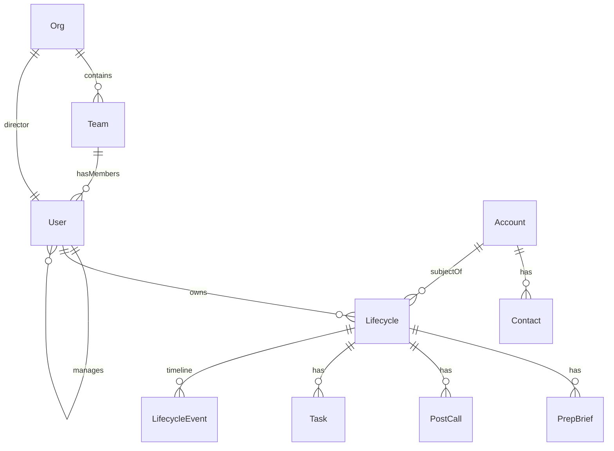

# Relationships — Foreign Keys, Cardinalities, and Lookups

Reference for how domain entities connect. See [ENTITY_CATALOG.md](./ENTITY_CATALOG.md) for entity definitions and [ID_STANDARDS.md](./ID_STANDARDS.md) for ID format.

---

## Entity relationship diagram



---

## Cardinality decisions

| Relationship | Cardinality | Implementation |
|--------------|-------------|----------------|
| Team → User | 1:N | `User.teamId` → `Team.id` |
| Org → Team | 1:N | `Team.orgId` → `Org.id` |
| Org → User (director) | 1:1 | `Org.directorId` → `User.id` |
| User → User (manager) | N:1 | `User.managerId` → `User.id` |
| User → Lifecycle | 1:N | `Lifecycle.ownerId` → `User.id` |
| Account → Contact | 1:N | `Contact.accountId` → `Account.id` |
| Account → Lifecycle | 1:N | `Lifecycle.accountId` → `Account.id` |
| User ↔ Account | M:N (logical) | **Lifecycle** as smart junction — no separate join table |
| Lifecycle → Artifacts | 1:N | `artifact.lifecycleId` → `Lifecycle.id` |
| Lifecycle → Events | 1:N | subcollection `lifecycles/{id}/events/{eventId}` |

---

## Foreign key map

### User

| FK field | Target | Required |
|----------|--------|----------|
| `teamId` | `Team.id` | No (null for org director) |
| `orgId` | `Org.id` | No |
| `managerId` | `User.id` | No |

### Team

| FK field | Target | Required |
|----------|--------|----------|
| `orgId` | `Org.id` | No |
| `managerId` | `User.id` | Yes |
| `memberIds[]` | `User.id` | No (denormalized roster) |

### Org

| FK field | Target | Required |
|----------|--------|----------|
| `directorId` | `User.id` | Yes |
| `teamIds[]` | `Team.id` | No (denormalized roster) |

### Contact

| FK field | Target | Required |
|----------|--------|----------|
| `accountId` | `Account.id` | Yes |

### Lifecycle

| FK field | Target | Required |
|----------|--------|----------|
| `ownerId` | `User.id` | Yes |
| `teamId` | `Team.id` | Yes |
| `orgId` | `Org.id` | Yes |
| `accountId` | `Account.id` | Yes |
| `primaryContactId` | `Contact.id` | No |

### Artifacts (PrepBrief, PostCall, Task)

| FK field | Target | Required |
|----------|--------|----------|
| `lifecycleId` | `Lifecycle.id` | Yes |
| `ownerId` | `User.id` | Yes (denormalized) |
| `teamId` | `Team.id` | Yes (denormalized) |
| `orgId` | `Org.id` | Yes (denormalized) |
| `accountId` | `Account.id` | Yes (denormalized) |

### ContactEvent

| FK field | Target | Required |
|----------|--------|----------|
| `contactId` | `Contact.id` | Yes (implicit via path) |
| `actorId` | `User.id` | Yes |

MEDDPICC lives on **Account.metadata.meddpicc** (deal-level). Contacts hold **DISC** and **influence** in `Contact.metadata`. Both merge incrementally from prep and post-call via `contact-service.js`.

### LifecycleEvent

| FK field | Target | Required |
|----------|--------|----------|
| `lifecycleId` | `Lifecycle.id` | Yes (implicit via path) |
| `actorId` | `User.id` | Yes |

---

## Denormalization

`ownerId`, `teamId`, and `accountId` are copied onto every artifact so queries and Firestore rules do not require joins:

```
Manager dashboard:  lifecycles where teamId == X
SE dashboard:       lifecycles where ownerId == Y
Account view:       lifecycles where accountId == Z
```

When a user changes team, either:

- Bulk-update artifact `teamId` (simple, immediate), or
- Accept historical `teamId` at time of activity (audit-friendly)

Default for MVP: update `User.teamId` only; new artifacts pick up new team. Historical artifacts keep original `teamId`.

---

## Uniqueness and conflict rules

| Entity | Constraint | Resolution |
|--------|------------|------------|
| User | One active user per `email` | Lookup by email before create |
| User | One `authUid` per user | Set on first SSO login |
| Account | One record per `slug` | Find-or-create in `account-service` |
| Contact | One per `(accountId, email)` | Upsert in `account-service` |
| Lifecycle | One **active** per `(ownerId, accountId)` | `findActiveLifecycle` before create |
| PostCall | One per `(ownerId, callIdentityKey)` | Upsert in `lifecycle-service` |

---

## Lookup cheat sheet

| Need | Query / path |
|------|--------------|
| User by email | `users where email == normalized` |
| User by auth | `authIndex/{firebaseUid}` → `userId` |
| Account by company | `accounts where slug == normalizedSlug` |
| Contact at account | `contacts where accountId == X and email == Y` |
| SE's lifecycles | `lifecycles where ownerId == userId orderBy lastActivityAt desc` |
| Team lifecycles | `lifecycles where teamId == X orderBy lastActivityAt desc` |
| Active engagement | `lifecycles where ownerId == X and accountId == Y and status == active` |
| Lifecycle timeline | `lifecycles/{id}/events orderBy timestamp desc` |
| Preps for lifecycle | `prepBriefs where lifecycleId == X orderBy createdAt desc` |
| Dedupe post-call | `postCalls where ownerId == X and callIdentityKey == Y` |

Indexes defined in [`firestore.indexes.json`](../firestore.indexes.json).

---

## User ↔ Account without M:N table

Multiple SEs can engage the same account. Each pair gets its own Lifecycle:

```
Account "Acme"
  ├── Lifecycle (owner: SE Alice)
  └── Lifecycle (owner: SE Bob)
```

Do **not** add `user_accounts` join table unless you need membership without engagement context.

---

## Future M:N (not implemented)

Add a join collection only when the requirement is real:

| Scenario | Collection |
|----------|------------|
| SE on multiple teams | `teamMembers/{teamId_userId}` |
| Contact at multiple accounts | `accountContacts/{accountId_contactId}` |
| Tags on lifecycles | `lifecycleTags/{lifecycleId_tagId}` |

---

## Related docs

- [ENTITY_CATALOG.md](./ENTITY_CATALOG.md)
- [RBAC.md](./RBAC.md)
- [adr/001-user-identity.md](./adr/001-user-identity.md)
- [DOMAIN_MODEL.md](./DOMAIN_MODEL.md)
