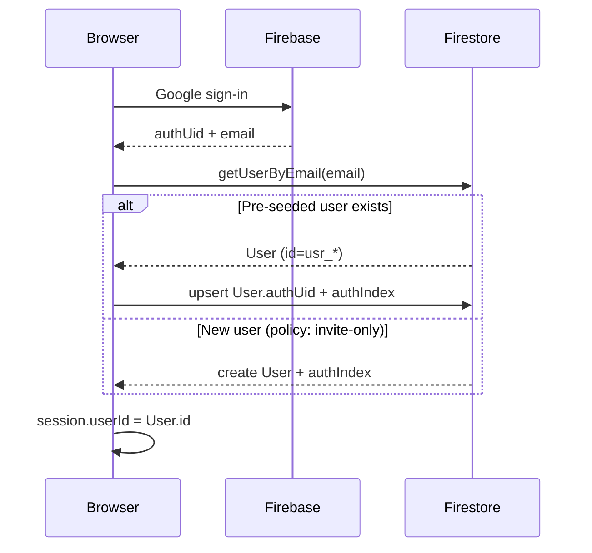

# ADR 001 — Internal User ID vs Firebase Auth UID

| Status | Accepted |
|--------|----------|
| Date | 2026-07-17 |
| Context | Domain Architecture Planning |

---

## Context

Lionpath uses Firebase Google SSO for production auth. The MVP stored Firebase `uid` directly as `User.id` and `ownerId` on all artifacts. Firestore security rules compare `request.auth.uid == ownerId`.

We want a product-ready identity model that:

- Keeps domain foreign keys stable if auth provider or email changes
- Supports admin pre-provisioning users by email before first login
- Separates **auth identity** from **domain identity**

---

## Decision

**Use an internal `User.id` (`usr_*`) as the domain primary key.** Firebase `uid` is stored as `authUid` on the User document and mirrored in `authIndex/{firebaseUid}` for Firestore rules.

---

## User document shape

```typescript
interface User {
  id: string;              // usr_* — document ID in users/{id}
  email: string;           // unique, normalized lowercase
  authUid: string | null;  // Firebase uid after first SSO login
  displayName: string;
  role: "se" | "manager" | "admin";
  teamId: string | null;
  managerId: string | null;
  status: "active" | "inactive";
  createdAt: number;
  updatedAt: number;
}
```

---

## Auth index

Firestore rules cannot query `users where authUid == X`. A thin index document resolves auth → domain user:

```
authIndex/{firebaseUid}
  userId: "usr_..."
  email: "se@freshworks.com"
  updatedAt: number
```

Rules helper:

```javascript
function currentUserId() {
  return get(/databases/$(database)/documents/authIndex/$(request.auth.uid)).data.userId;
}

function isOwner(ownerId) {
  return isSignedIn() && currentUserId() == ownerId;
}
```

The signed-in user reads their own profile via `users/{currentUserId()}`, not `users/{request.auth.uid}`.

---

## Login resolution flow



1. Firebase returns `authUid` and verified `email`
2. Lookup `users` by normalized `email` (primary for pre-seeded users)
3. If found: set `authUid`, write `authIndex/{authUid}`
4. If not found and invite-only: reject or create per admin policy
5. Session stores `userId` (internal) — **not** `authUid` as `ownerId`

---

## Session shape

```javascript
{
  userId: "usr_...",     // domain id — used as ownerId everywhere
  authUid: "firebase...", // auth only; optional in dummy mode
  email: "...",
  role: "...",
  teamId: "...",
  name: "..."
}
```

Backward compatibility: `session.uid` is an alias for `session.userId` during transition.

---

## Dummy auth mode

Dummy login does not use Firebase. Internal IDs are **deterministic** from email:

```
stableUserIdForEmail("se@freshworks.com") → usr_dummy_se_freshworks_com
```

No `authIndex` entry in dummy mode. `authUid` remains `null`.

---

## Foreign keys

All domain records use **internal User.id**:

| Field | Points to |
|-------|-----------|
| `ownerId` | `User.id` |
| `actorId` | `User.id` |
| `managerId` | `User.id` |
| `Team.managerId` | `User.id` |
| `Team.memberIds[]` | `User.id` |

Never use `authUid` or email as `ownerId`.

---

## Consequences

### Positive

- Email change: update User.email; FKs unchanged
- Auth provider swap: update `authUid` + `authIndex`; domain data untouched
- Pre-seed users via CSV before first Google login
- Consistent ID format with other entities (`usr_`, `acc_`, etc.)

### Negative / tradeoffs

- Migration required for existing Firestore data keyed by Firebase uid
- Extra write on login (`authIndex` doc)
- Rules must use `currentUserId()` instead of `request.auth.uid` for ownership

---

## Alternatives considered

| Option | Rejected because |
|--------|------------------|
| Firebase uid as User.id | Ties domain to auth provider; breaks pre-seed by email cleanly |
| Email as User.id | Emails change; awkward as document ID |
| Query users by authUid in rules | Firestore rules cannot run collection queries |

---

## Implementation references

- [`web/domain/id.js`](../web/domain/id.js) — ID generation
- [`web/domain/seed-dev.js`](../web/domain/seed-dev.js) — login upsert + authIndex
- [`web/auth.js`](../web/auth.js) — session.userId
- [`firestore.rules`](../firestore.rules) — currentUserId()
- [`worker/scripts/migrate-user-ids.mjs`](../worker/scripts/migrate-user-ids.mjs) — cutover script

---

## Related ADRs

None yet. Future: multi-team membership, orgId for multi-tenant.
