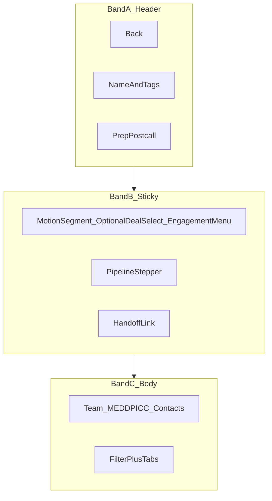

# Account record detail — wireframe v2

Product wireframe and implementation design for the Accounts **detail** view (`#accounts/{accountId}`). Routing and domain behavior are unchanged; this doc locks layout and UI chrome.

**Implementation:** [`web/account-view.js`](../web/account-view.js), [`web/lifecycle.css`](../web/lifecycle.css)

**Usability follow-up:** [account-record-v2.1-left-column.md](./account-record-v2.1-left-column.md) — full-width contacts band, collapsible MEDDPICC, compact table cells.

---

## Layout — three bands

```text
┌─────────────────────────────────────────────────────────────────────────┐
│ A. RECORD HEADER                                                         │
│  ← All accounts    {Name}  [domain] [motion] [ICP]      [New prep][Post]│
└─────────────────────────────────────────────────────────────────────────┘
┌─────────────────────────────────────────────────────────────────────────┐
│ B. PURSUIT BAR (sticky)                              aria-label set      │
│  Row 1: [ New business | Expansion ]  [Switch deal ▼ if 2+ active]     │
│         [Lens ▼ if multi-SE]  [Engagement ▼ menu]                        │
│  Row 2: ── Research — Discovery — Demo — Eval — BC — Won/Lost/Nurture ── │
│  Row 3: Hand off to expansion (link, if active NB deal)                  │
└─────────────────────────────────────────────────────────────────────────┘
┌──────────────────────────────┬──────────────────────────────────────────┐
│ C. BODY (5 / 7 grid)           │                                          │
│  Deal team                   │  [ Filter activity & artifacts… ]        │
│  MEDDPICC                    │  Activity | Preps | Post-calls | Tasks   │
│  Contacts (table)            │                                          │
└──────────────────────────────┴──────────────────────────────────────────┘
```



---

## Band A — Record header

| Element | Behavior |
|---------|----------|
| Back | Returns to account list |
| Title + tags | Domain, deal motion tag, optional ICP tag |
| New prep / Post-call | Writes `setAccountEngagementContext({ accountId, dealId, prepType, lifecycleId })` then navigates |

---

## Band B — Pursuit bar

| Row | Content | Rules |
|-----|---------|--------|
| 1 | Motion segment | `fw-radio-group` with `data-action="deal-type"` values `new_business` / `expansion` |
| 1 | Switch deal | `fw-select` `data-action="deal-select"` **only when** `activeDeals.length > 1` |
| 1 | Lifecycle lens | Existing `data-action="lifecycle-lens"` when multiple SEs on deal team |
| 1 | Engagement | `<details class="account-engagement-menu">` with `data-action="engagement-menu"` — checkboxes for Apply / Remember; optional Clear override |
| 2 | Pipeline | Compact stepper; **no** duplicate stage badge beside stepper |
| 3 | Handoff | Text-style button `data-action="handoff-expansion"` when active NB deal exists |

Changing motion or deal calls existing `resolveDealForEngagement` + refresh (see `wireDetailEvents`).

---

## Band C — Body

- **Left:** Deal team → MEDDPICC → Contacts table (Name, Title, Email, DISC, Influence, Primary, Activity expand).
- **Right:** Search input `#account-detail-search` above tabs; filter applies to all `[data-search-text]` in both columns.
- **Tabs:** Activity (default) | Preps | Post-calls | Tasks.

---

## UI states

| State | Band B |
|-------|--------|
| No deals yet | Motion segment + pipeline from lifecycle lens; no deal select |
| 1 active deal | Motion segment only; no deal dropdown |
| 2+ active deals | Motion + **Switch deal** select |
| Post-handoff | Often 1 active expansion + archived NB → no select until 2 active |
| `engagementOverride` on account | Motion reflects override; Remember may show checked after persist |

---

## Design spec (implementation rules)

| Topic | Rule |
|--------|------|
| Density | Flat `account-record-section` wrappers; avoid stacking `fw-card` per subsection where possible |
| Sticky | `.account-record-subheader` only; ~140px target height on desktop; pipeline wraps on narrow viewports |
| Motion | Segment labels “New business” / “Expansion”; primary fill on selected option |
| Deal select | Label “Switch deal”; visible iff more than one **active** deal |
| Engagement | Menu replaces inline subheader checkboxes |
| Pipeline | Current stage shown only on stepper |
| Search | Right column header; `#account-detail-no-matches` remains in detail root for filter script |
| A11y | Pursuit bar `aria-label="Pursuit and pipeline"`; engagement menu keyboard reachable via native `<details>` |

---

## Interactions (unchanged domain)

- Prep/post-call from account: context includes selected `dealId` and motion type.
- Hash `#accounts/{id}/deals/{dealId}` when user switches deal (app router).
- Manager/deal-team override: `setAccountEngagementOverride` when Remember is checked.

---

## Manual QA checklist

- [ ] Single active deal: no Switch deal dropdown; no duplicate Research badge next to pipeline
- [ ] Two active deals: Switch deal appears; activity scoped to selected deal
- [ ] Engagement menu: Apply / Remember / Clear behave as before
- [ ] Search filters contacts and tab content
- [ ] Hand off to expansion still works

---

## Related

- [ADR 003 — Account, Deal, engagement](../adr/003-account-deal-engagement.md)
- [ENTITY_CATALOG.md](../ENTITY_CATALOG.md) — `account.metadata.engagementOverride`
